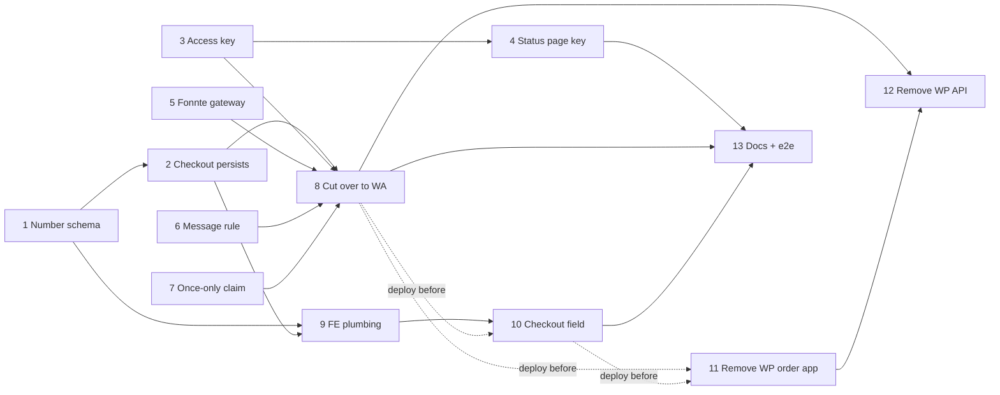

# PRD: WhatsApp Order-Ready Notifications via Fonnte (Replacing Guest Web Push)

**Status:** Draft for review
**Scope:** collect a WhatsApp number at order-app checkout, send the guest **one** WhatsApp message
through [Fonnte](https://fonnte.com/) when a staff member marks their table order ready, and
**remove** the guest Web Push feature built by
[`docs/prd-order-web-push-notifications.md`](./prd-order-web-push-notifications.md).
**Supersedes:** `docs/prd-order-web-push-notifications.md` in full. Marking an order ready
([`docs/prd-order-fulfillment-status.md`](./prd-order-fulfillment-status.md)), the status-page
polling loop and the KDS staff notifications
([`docs/prd-kds-order-notifications.md`](./prd-kds-order-notifications.md)) are unchanged.

---

## Problem Statement

A guest orders from their table in `apps/order-web`, pays, and waits. When the barista taps
**Mark as ready** in the POS, `TransactionUsecase.CompleteTransaction`
(`apps/api/domain/transaction_usecase.go:380`) sets `transactions.completed_at`. The guest should
find out.

Today that happens through Web Push (`docs/prd-order-web-push-notifications.md`), and the channel
has turned out to be the wrong one for this audience:

1. **It only reaches guests who opted in on a card they may never see.** The opt-in
   (`libs/ui/src/presentation/views/components/orderStatus/OrderNotificationOptIn.tsx`) lives on
   the preparing screen and needs an explicit tap, a browser permission grant, and a live service
   worker. A guest who pays and immediately locks their phone never subscribes, so the
   `GuestNotificationUsecase` dispatcher (`apps/api/domain/guest_notification_usecase.go`) records
   the order as `skipped` with `detail = 'no active subscription for session'`.
2. **iOS needs the app on the Home Screen.** The old PRD's D12 put this down as its biggest risk:
   iOS Safari in a tab has no `PushManager`. Most iOS guests will not install a web app just to
   pick up a coffee.
3. **Android battery savers delay or drop pushes.** Xiaomi, Oppo, Vivo and Samsung all do this,
   as the old PRD's own Risks section says.
4. **A lot of code for one notification.** A service worker (`apps/order-web/public/sw.js`), a
   manifest, VAPID key management (`apps/api/cmd/generatevapidkeys`, three `WEB_PUSH_*` secrets in
   `.github/workflows/deploy-api.yml`), a browser repository (`libs/ui/src/data/browser/`), a
   subscription FSM with seven states, and a subscription table.

The old PRD already named the fix as its Option B, _"SMS / WhatsApp on order ready"_, and turned
it down only because checkout did not collect a phone number
(`PaymentCheckoutRequest` is `{ customerName, method }`, `libs/api-contract/src/api.yaml`).
WhatsApp is what Indonesian guests already use. It needs no install and no permission prompt,
behaves the same on every OS, and reaches a phone that has left the venue's Wi-Fi.

There is also a second, smaller problem: **Web Push can send a guest two "ready" messages for one
order.** The old D7 made `UncompleteTransaction` delete the outbox row
(`transaction_usecase.go:449`), so un-marking and re-marking an order sends again. That was fine
when a push was free. Fonnte bills against a **monthly message quota**, so every repeat now costs
real money.

### Root cause

**The only way to reach the guest depends on the guest's browser, and that browser is the least
reliable device in the flow.** A phone number reaches the person directly. The system has never
asked for one: `customers` (`000024_create_customers.up.sql`) stores `session_id` and `name` only.

---

## How the Industry Handles This

- **Toast, Square, Lightspeed "order ready" SMS.** Venues without an app mostly do this. They
  collect a phone at checkout, send one message per order, and keep the status screen as a
  fallback.
- **Indonesian F&B (Fore, Kopi Kenangan, Janji Jiwa, GoFood/GrabFood merchants).** Order updates
  come over WhatsApp. Guests expect a WhatsApp number field, and a line explaining what it is for,
  at checkout.
- **Unofficial WhatsApp gateways (Fonnte, Wablas, Woowa).** These are common in Indonesian SMEs.
  They drive a real WhatsApp account through a linked device, charge a monthly quota, and need no
  Meta template approval. The trade-off is ban risk (Risks).
- **WhatsApp Business Cloud API (Meta, official).** Needs a verified business, pre-approved
  message templates and per-conversation pricing. It is the path for high volume, and heavy
  procurement for one café.

What this design takes from them:

1. **Ask for the number at checkout and say why, in the same place.** A note under the field that
   explains its purpose is also the purpose statement Indonesia's personal data protection law
   expects (UU No. 27/2022, Risks).
2. **One message per order, and it summons the guest.** It carries enough to identify the order
   at the counter, plus a link to the page that proves it.
3. **Keep the status page working** for the guest whose message never arrived.

---

## Alternatives Considered

### 1. Which WhatsApp transport?

**Option A — Fonnte `POST https://api.fonnte.com/send`, behind a `WhatsAppGatewayRepository`
interface. ← Recommended (and requested)**

- ✅ One HTTP call with a device token. No template approval, no Meta Business verification, and
  the monthly-quota pricing fits the volume of one venue.
- ✅ Free-form message text, so the order details (items, table, payment method) can go in without
  a pre-approved template.
- ✅ Behind an interface, like `PaymentGatewayRepository` (DOKU) and `KdsPushGatewayRepository`
  (Expo), so moving to Option B is a one-package swap.
- ❌ It is an unofficial gateway driving a linked WhatsApp device, so the sending number can be
  banned (Risks).
- ❌ Delivery is only as reliable as the phone linked to Fonnte. If that device is offline, sends
  fail.

**Option B — WhatsApp Business Cloud API (Meta).**

- ✅ Official, with no ban risk and delivery receipts through webhooks.
- ❌ Business verification, a template for every message shape (items vary per order, so they
  must be squeezed into template variables), and per-conversation cost. Too much procurement for
  this.

**Option C — SMS gateway (Zenziva, Twilio).**

- ❌ Costs more per message in Indonesia than a Fonnte quota, carriers filter A2P links, and it
  is not where guests look.

**Verdict: Option A**, as requested, behind an interface.

### 2. How is "notify only once" enforced?

**Option D — Keep the existing `guest_notifications` outbox, whose `UNIQUE (transaction_id)` key
already makes enqueue idempotent, and stop deleting the row on uncomplete. ← Recommended**

- ✅ A one-line removal (`transaction_usecase.go:449`) plus the existing
  `INSERT … ON DUPLICATE KEY UPDATE id = id`. A second completion hits the unique key and does
  nothing.
- ✅ The row that records the send also blocks the next one. There is no second source of truth
  to fall out of step.

**Option E — A `transactions.whatsapp_notified_at` flag.**

- ❌ Records the same fact twice: the flag and the outbox row. It also puts an order-app concern
  on a table that POS walk-in sales share.

**Option F — Keep the delete, and rate-limit per transaction instead (e.g. at most one send per
10 minutes).**

- ❌ Still spends quota on the second completion, which the requirement rules out.

**Verdict: Option D.** It reverses the old D7 on purpose (D6 below).

### 3. How does the link in the message open the order on any browser?

The link points at the order app's status page, `/orders/{partnerReferenceNo}`. Today that page is
**scoped to the session that paid.** `GetPaymentStatus` returns `404` when
`payment.SessionId != sessionId` (`apps/api/domain/payment_usecase.go:469`), and the session comes
from the `gl_session_id` cookie. WhatsApp often opens links in its in-app browser, or in a
different default browser from the one the guest ordered in. **Without a change, most guests who
tap the link would see "Pesanan tidak ditemukan".**

**Option G — Put a per-payment random access key in the link (`?k=…`), stored on the payment row,
accepted by `GET /payments/{ref}` as an alternative to a matching session. ← Recommended**

- ✅ The key goes only to the phone number the guest typed, so the link works as a capability
  URL.
- ✅ Keeps `docs/prd-order-checkout-qris-doku.md` D18 intact: the reference is still "defence in
  depth, not the lock". Now there are two locks (session or key), not zero.
- ✅ Revocable per payment by nulling the column, with no shared secret to rotate.
- ❌ Adds one column and a small change to the order-status slice (phases 3 and 4).

**Option H — Make `GET /payments/{ref}` public, since the reference is already 13 random Crockford
base32 characters.**

- ❌ Reverses an explicit, documented security decision (D18 above) for every payment ever made,
  including ones whose reference has been visible on a POS screen or a DOKU report.

**Option I — HMAC-signed link (`k = HMAC(secret, reference)`), stateless.**

- ✅ No column.
- ❌ Adds a new secret to `deploy-api.yml` that must never leak or rotate, and a leaked secret
  would expose every order's page at once. Phase 1 already migrates `payments`, so one more column
  costs nothing.

**Verdict: Option G.**

### 4. Is the WhatsApp number required?

**Option J — Required in the order-app UI, optional in the API contract. ← Recommended**

- ✅ Meets the acceptance criterion: the guest is asked, and a number collected at checkout is
  the only way the notification can work.
- ✅ The API accepts a request without it (the row is recorded as `skipped`, and checkout still
  succeeds). A cached `apps/order-web` bundle from before the change, running against the new API
  during deploy skew, therefore keeps working. `apps/order-web` deploys to Vercel and `apps/api`
  to a VPS, from different pipelines.
- ❌ The server does not enforce the product rule. That is acceptable: a missing number only
  loses the guest their own notification, and no other data depends on it.

**Option K — Optional everywhere, with a "notify me" checkbox.** ❌ Adds friction to the UI and a
choice most guests would not understand. See Open Question 1.

**Option L — Required in the API too.** ❌ Breaks checkout for any old bundle still in the field
during rollout, for a rule that only protects the guest's own convenience.

**Verdict: Option J.**

---

## System Design Overview

### The path, end to end

```
 Guest (order app)                                   Staff (POS)
      │                                                   │
      │ Cart → "Pesan"                                     │ taps "Mark as ready"
      ▼                                                   ▼
 CustomerDetailsSheet                            PUT /transactions/{id}/complete
  ├─ Nama            (prefilled from customers)            │
  ├─ Nomor WhatsApp  (prefilled from customers)            ▼
  │   "Nomor ini akan kami gunakan untuk             TransactionUsecase.CompleteTransaction
  │    mengabari Anda saat pesanan siap."             │  (inside BeginTransaction)
  ▼                                                   ├─ guards: source = 'order', not completed
 POST /carts/current/checkout                         ├─ transactionRepository.CompleteTransaction
  { customerName, customerWhatsappNumber, method }    ├─ payment lookup ⇒ session_id, whatsapp_number
  X-Session-Id                                        └─ INSERT guest_notifications … ON DUPLICATE
      │                                                  KEY no-op ◄── once per transaction, ever (D6)
      ▼                                                   │
 PaymentUsecase.Checkout                                COMMIT ─► TriggerDispatch() (goroutine)
  ├─ NormalizeWhatsappNumber  (400 if invalid)            │        + the existing 15 s sweeper
  ├─ customers upsert (name, whatsapp_number)             ▼
  ├─ payments.customer_whatsapp_number (snapshot)   GuestNotificationUsecase.DispatchPending
  └─ payments.access_key (random, 22 chars)          ├─ claim: pending ∧ transaction completed
                                                     │   UPDATE … SET status='sending' WHERE
                                                     │   status='pending'   (atomic, D8)
                                                     ├─ BuildGuestWhatsappMessage(tx, payment, url)
                                                     ├─ WhatsAppGatewayRepository.Send
                                                     │     └─ POST api.fonnte.com/send
                                                     │        Authorization: <FONNTE_TOKEN>
                                                     │        target=62812…, countryCode=0
                                                     └─ accepted ⇒ sent · rejected ⇒ retry
                                                        · unknown ⇒ failed, never resent (D9)
                                                              │
                                                              ▼
                                                     Guest's WhatsApp
                                                     "Pesanan #12 sudah siap diambil …
                                                      https://<order-web>/orders/ORD…?k=…"
                                                              │ tap (any browser)
                                                              ▼
                                                     /orders/{ref}?k=…  ─► GET /payments/{ref}
                                                                           X-Order-Access-Key
                                                     OrderReadyView — shown to the cashier
```

Web Push disappears from both ends. `sw.js` becomes a service worker that unregisters itself
(D12), and the subscription table, routes, gateway and VAPID keys are deleted.

### Table design

Five migrations after `000035_add_kds_notification_kind`. **Numbers are provisional.** Each phase
takes the next free number when it merges; see _Phase dependencies_ for why.

```sql
-- 000036_add_customer_whatsapp_number.up.sql                              (phase 1)
ALTER TABLE customers
  ADD COLUMN whatsapp_number VARCHAR(16) NULL AFTER name;       -- normalized digits, e.g. 6281234567890
ALTER TABLE payments
  ADD COLUMN customer_whatsapp_number VARCHAR(16) NULL AFTER session_id;  -- snapshot at checkout (D3)

-- 000037_add_payment_access_key.up.sql                                    (phase 3)
ALTER TABLE payments
  ADD COLUMN access_key CHAR(22) NULL AFTER partner_reference_no;  -- base64url(16 random bytes) (D4)

-- 000038_add_guest_notification_claimed_at.up.sql                         (phase 7)
ALTER TABLE guest_notifications
  ADD COLUMN claimed_at TIMESTAMP NULL AFTER attempt_count;     -- set on pending → sending (D8)

-- 000039_add_guest_notification_whatsapp.up.sql                           (phase 8)
ALTER TABLE guest_notifications
  ADD COLUMN whatsapp_number     VARCHAR(16) NULL AFTER session_id,   -- snapshot at enqueue
  ADD COLUMN provider_message_id VARCHAR(64) NULL AFTER detail;       -- Fonnte's id[0], for support

-- 000040_drop_web_push_subscriptions.up.sql                               (phase 12)
DROP TABLE web_push_subscriptions;
```

Resulting shapes:

| Table                    | Column                                                                                                                                                      | Notes                                                                                                                                                            |
| ------------------------ | ----------------------------------------------------------------------------------------------------------------------------------------------------------- | ---------------------------------------------------------------------------------------------------------------------------------------------------------------- |
| `customers`              | `id, session_id (UNIQUE), name, **whatsapp_number**, created_at, updated_at, deleted_at`                                                                    | Latest number this session gave. Prefills the next checkout.                                                                                                     |
| `payments`               | `…, session_id, **customer_whatsapp_number**, partner_reference_no, **access_key**, …`                                                                      | Number as given _for this order_. The key opens the status page from any browser.                                                                                |
| `guest_notifications`    | `id, transaction_id (UNIQUE), session_id, **whatsapp_number**, status, attempt_count, **claimed_at**, detail, **provider_message_id**, created_at, sent_at` | `status ∈ pending \| sending \| sent \| failed \| skipped`. `sending` is new (D8). The table keeps its name: it is the guest's outbox whichever channel it uses. |
| `web_push_subscriptions` | —                                                                                                                                                           | Dropped.                                                                                                                                                         |

The `down` migrations reverse each step exactly. `000040`'s down recreates the table from
`000033`'s DDL, empty. The subscriptions are worthless once the VAPID keys are deleted anyway.

#### `guest_notifications.status` lifecycle

```
             enqueue (CompleteTransaction)            no number / gateway not configured
  (none) ─────────────────────────────► pending ─────────────────────────────────────► skipped
                                           │ ▲
                     claim (tx completed)  │ │ rejected by Fonnte, attempt_count < 5
                                           ▼ │
                                        sending ──── accepted ─────────────────────► sent
                                           │
                                           ├──── rejected, attempt_count reaches 5 ──► failed
                                           └──── unknown outcome / stale > 5 min ────► failed (never resent)

  UncompleteTransaction: row untouched.  Re-complete: INSERT hits UNIQUE(transaction_id), no-op.
```

### API contract changes (`libs/api-contract/src/api.yaml`)

```yaml
# Customer (response of GET /customers/current) — phase 1
Customer:
  type: object
  required: [name, whatsappNumber]
  properties:
    name: { type: string, maxLength: 60 }
    whatsappNumber:
      type: string # normalized digits ("6281234567890"), "" when never given
      maxLength: 16

# PaymentCheckoutRequest — phase 2
PaymentCheckoutRequest:
  type: object
  required: [customerName]
  properties:
    customerName: { type: string, maxLength: 60 }
    customerWhatsappNumber: # optional in the contract, required by the UI (D5)
      type: string
      maxLength: 20 # raw input; the server normalizes
    method: { type: string, enum: [qris, cash] }

# GET /payments/{partnerReferenceNo} — phase 3
parameters:
  - in: header
    name: X-Order-Access-Key # optional; grants read access without a matching session (D4)
    required: false
    schema: { type: string, maxLength: 64 }
```

| Change     | Operation                                                                                                        | Phase |
| ---------- | ---------------------------------------------------------------------------------------------------------------- | ----- |
| Additive   | `Customer.whatsappNumber`                                                                                        | 1     |
| Additive   | `PaymentCheckoutRequest.customerWhatsappNumber`                                                                  | 2     |
| Additive   | `paymentFindByPartnerReferenceNo` header `X-Order-Access-Key`                                                    | 3     |
| **Remove** | `webPushConfigFind`, `webPushSubscriptionCreate`, `webPushSubscriptionDelete`, their three schemas and responses | 12    |

`Payment` and `Transaction` responses are unchanged. Neither the WhatsApp number nor the access
key is ever returned in a payment or transaction body. `apps/pos-web` and `apps/pos-mobile` see no
contract change at all.

**Checkout validation (new `400` reasons):** `customerWhatsappNumber` that does not normalize (D2)
→ `400 "customerWhatsappNumber must be a valid WhatsApp number"`.

### Backend components

| Layer      | File                                                                                                                                                                                                                                                                               | Status  | Contents                                                                                                                                                                                   |
| ---------- | ---------------------------------------------------------------------------------------------------------------------------------------------------------------------------------------------------------------------------------------------------------------------------------- | ------- | ------------------------------------------------------------------------------------------------------------------------------------------------------------------------------------------ |
| Domain     | `domain/whatsapp_number.go` (+ `_test`)                                                                                                                                                                                                                                            | new     | `NormalizeWhatsappNumber(raw string) (string, *Error)` — pure (D2)                                                                                                                         |
| Domain     | `domain/customer_{entity,repository,usecase}.go`                                                                                                                                                                                                                                   | changed | `Customer.WhatsappNumber *string`; `UpsertCustomerBySessionId(ctx, sessionId, name, whatsappNumber *string)`; `GetCurrentCustomer` replaces `GetCurrentCustomerName`                       |
| Domain     | `domain/payment_{entity,usecase}.go`                                                                                                                                                                                                                                               | changed | `Payment.CustomerWhatsappNumber *string`, `Payment.AccessKey *string`; `Checkout` takes the number; `GetPaymentStatus(ctx, sessionId, ref, accessKey)`; `GenerateOrderAccessKey()`         |
| Domain     | `domain/order_link.go` (+ `_test`)                                                                                                                                                                                                                                                 | new     | `BuildOrderStatusUrl(baseUrl, reference, accessKey string) string` — pure                                                                                                                  |
| Domain     | `domain/whatsapp_gateway_repository.go`                                                                                                                                                                                                                                            | new     | `WhatsAppMessage{To, Body}`, `WhatsAppSendResult{Outcome, ProviderMessageId, Detail}`, `WhatsAppSendOutcome = accepted \| rejected \| unknown`, `WhatsAppGatewayRepository.Send(ctx, msg)` |
| Domain     | `domain/guest_whatsapp_message.go` (+ `_test`)                                                                                                                                                                                                                                     | new     | `BuildGuestWhatsappMessage(transaction Transaction, method PaymentMethod, orderUrl string) string` — pure (FR-6)                                                                           |
| Domain     | `domain/guest_notification_{entity,repository,usecase}.go`                                                                                                                                                                                                                         | changed | `sending` status; atomic claim; `ExpireStaleSending`; transport swapped from Web Push to WhatsApp; `DeleteGuestNotificationByTransactionId` and `BuildGuestPushMessage` removed            |
| Domain     | `domain/transaction_usecase.go`                                                                                                                                                                                                                                                    | changed | `CompleteTransaction` snapshots the number into the enqueue; `UncompleteTransaction` no longer deletes the outbox row (D6)                                                                 |
| Data       | `data/fonnte/fonnte_repo.go` (+ `_test`)                                                                                                                                                                                                                                           | new     | Fonnte client; `NewDisabledWhatsAppGateway()` when `FONNTE_TOKEN` is empty (D10)                                                                                                           |
| Data       | `data/mysql/{customer,payment,guest_notification}_*`                                                                                                                                                                                                                               | changed | new columns; claim query joins `transactions.completed_at IS NOT NULL`                                                                                                                     |
| CLI        | `cmd/fonntecheck/main.go`                                                                                                                                                                                                                                                          | new     | `go run ./cmd/fonntecheck -to 0812…` sends one test message and prints Fonnte's raw response, like `cmd/dokucheck`                                                                         |
| REST       | `presentation/restapi/{customer,payment}_{handler,transformer}.go`                                                                                                                                                                                                                 | changed | new fields and header                                                                                                                                                                      |
| Config     | `utils/env.go`, `.env.example`, `.github/workflows/deploy-api.yml`                                                                                                                                                                                                                 | changed | `+ FONNTE_TOKEN`, `+ FONNTE_BASE_URL` (default `https://api.fonnte.com`), `+ ORDER_WEB_BASE_URL`; `− WEB_PUSH_*`                                                                           |
| **Delete** | `domain/web_push_*`, `data/webpush/`, `data/mysql/web_push_subscription_*`, `data/mock/web_push_*`, `presentation/restapi/web_push_subscription_*`, `cmd/generatevapidkeys/`, the config route in `public_{handler,route}.go`, `github.com/SherClockHolmes/webpush-go` in `go.mod` | removed | phase 12                                                                                                                                                                                   |

`main.go` keeps `runMaintenanceSweeper` (`main.go:254`), which already calls
`guestNotificationUsecase.DispatchPending` on every tick. It gains an
`ExpireStaleSending` call (D8), and its guest-notification constructor swaps two Web Push
dependencies for one WhatsApp gateway.

### Frontend architecture (`libs/ui`, `@gatherloop-pos/ui/order` graph only)

**Checkout slice (changed).**

```
apps/order-web/src/pages/t/[code]/cart/index.tsx   getServerSideProps
  └─ ApiCustomerRepository.fetchCurrentCustomer()  ─►  { name, whatsappNumber }   (was fetchCurrentName)
app/order/Cart.tsx                                 composition root
  └─ new CheckoutUsecase(paymentRepository, { customerName, customerWhatsappNumber })
presentation/handlers/order/CartHandler.tsx        maps FSM state → CustomerDetailsSheetProps
presentation/views/components/checkout/
  CustomerDetailsSheet.tsx (+ .stories.tsx)        renamed from CustomerNameSheet; + WhatsApp input + note
domain/usecases/checkout.ts (+ .test.ts)           FSM, see below
domain/entities/Customer.ts                        Customer, normalizeWhatsappNumber, formatWhatsappNumberForInput
domain/repositories/{customer,payment}.ts          fetchCurrentCustomer; checkout({ customerName, whatsappNumber, method })
data/api/{customer,payment}.ts, data/mock/{customer,payment}.ts
```

`CheckoutUsecase` stays a finite state machine (`extends Usecase<State, Action, Params>`). The
change is to its context and one action. Names that would otherwise lie get renamed in the same
phase:

```
Context: + whatsappNumber: string
         + whatsappNumberErrorMessage: string | null
         nameErrorMessage (unchanged)

idle ──ASK_DETAILS──► askingDetails ──SUBMIT_DETAILS──► creatingPayment ──► created
                        │  ▲  CHANGE_NAME                (both valid)           └──► error ──SUBMIT_DETAILS──┘
                        │  │  CHANGE_WHATSAPP_NUMBER   ◄── new
                        │  │  CHANGE_METHOD
                        │  └── SUBMIT_DETAILS with an invalid field (stays, sets that field's error)
                        └──CANCEL_DETAILS──► idle

renames: askingName → askingDetails · ASK_NAME → ASK_DETAILS · SUBMIT_NAME → SUBMIT_DETAILS · CANCEL_NAME → CANCEL_DETAILS
```

The sheet:

```
┌──────────────────────────────────────────────┐
│  Data pemesan                                │
│                                              │
│  Nama                                        │
│  ┌────────────────────────────────────────┐  │
│  │ Andi                                   │  │
│  └────────────────────────────────────────┘  │
│  Nomor WhatsApp                              │
│  ┌────────────────────────────────────────┐  │
│  │ 0812 3456 7890                         │  │  inputMode="tel", autoComplete="tel"
│  └────────────────────────────────────────┘  │
│  ⓘ Nomor ini akan kami gunakan untuk         │  ← the required note
│    mengabari Anda lewat WhatsApp saat         │
│    pesanan siap diambil.                      │
│                                              │
│  ( ) Bayar dengan QRIS  ( ) Cash di Kasir    │  (unchanged)
│  [   Lanjutkan ke pembayaran   ]             │
│  [            Batal            ]             │
└──────────────────────────────────────────────┘
```

**Order-status slice (changed).**

```
apps/order-web/src/pages/orders/[reference].tsx    reads ctx.query.k → props.accessKey
app/order/OrderStatus.tsx                          new ApiPaymentRepository(sessionRepository, { accessKey })
                                                   − ServiceWorkerWebPushRepository, − ApiWebPushSubscriptionRepository,
                                                   − OrderNotificationSubscribeUsecase
data/api/payment.ts                                fetchPayment sends X-Order-Access-Key when constructed with one
presentation/handlers/order/OrderStatusHandler.tsx − notificationSubscribe / notificationOptIn
presentation/views/screens/order/OrderStatusScreen.tsx, components/orderStatus/OrderPreparingView.tsx
                                                   − notificationOptIn prop
```

`OrderStatusUsecase` and its `PaymentRepository.fetchPayment(reference)` interface stay as they
are. The key is a transport detail of the API repository, so the composition root passes it into
the repository's constructor, and the FSM never learns it exists.

**Deleted from `libs/ui`:** `domain/entities/WebPushSubscription.ts`,
`domain/repositories/{webPush,webPushSubscription}.ts`,
`domain/usecases/orderNotificationSubscribe{,.test}.ts`,
`data/api/webPushSubscription{,.transformer}.ts`, `data/browser/` (the whole directory),
`data/mock/{webPush,webPushSubscription}.ts`,
`presentation/views/components/orderStatus/OrderNotificationOptIn{,.stories}.tsx`, and their
barrel lines. `domain/repositories/pushToken.ts`'s `PermissionStatus` stays: the KDS app uses it.

**`apps/order-web`:** `public/sw.js` is replaced by a self-unregistering worker (D12).
`next.config.js` keeps its `/sw.js` `no-cache` header so the replacement reaches browsers.
`manifest.webmanifest`, `public/icons/*` and the `_document.tsx` links stay (D13).

### The message

Built by `BuildGuestWhatsappMessage` (FR-6). Example for a two-item QRIS order:

```
Halo *Andi*, pesanan Anda sudah siap diambil! 🎉

*No. Pesanan:* #12
*Nama:* Andi
*Meja:* Meja 4
*Pembayaran:* QRIS

*Pesanan:*
2x Coffee Latte - Hot - Vanilla
_Catatan: tanpa sedotan_
1x Croissant

Tunjukkan halaman ini ke kasir untuk mengambil pesanan:
https://order.gatherloop.id/orders/ORD7K2M9QX4B1HZT?k=q3Vd0bX9pL2sR8tY1wZa7c

Terima kasih!
```

Every acceptance-criteria field is there: transaction number (the daily number from
`docs/prd-daily-transaction-number.md`, not the row id), name, table, items, payment method
(`qris` → `QRIS`, `cash` → `Tunai`), and the link. Bold and italics use WhatsApp's `*…*` and
`_…_` markup. The copy is Indonesian and uses _Anda_, matching the rest of the guest surface
(`CustomerNameSheet`'s _"Nama Anda"_).

---

## Proposed Solution

### FR-1 — Checkout asks for a WhatsApp number

The checkout sheet (`CustomerNameSheet`, renamed `CustomerDetailsSheet`) adds a **Nomor WhatsApp**
input below the name. Under the input, always visible, is the note _"Nomor ini akan kami gunakan
untuk mengabari Anda lewat WhatsApp saat pesanan siap diambil."_ Submitting validates name and
number together and shows errors per field: _"Nomor WhatsApp tidak boleh kosong"_ and _"Nomor
WhatsApp tidak valid"_. The input uses `inputMode="tel"` and `autoComplete="tel"`, so mobile
keyboards open on the dial pad and can autofill the number.

### FR-2 — The number is normalized once, on the server

`NormalizeWhatsappNumber` strips spaces, dashes, dots and parentheses, then:

| Input shape         | Result                           | Example                               |
| ------------------- | -------------------------------- | ------------------------------------- |
| `08…`               | leading `0` → `62`               | `0812-3456-7890` → `6281234567890`    |
| `628…`              | unchanged                        | `6281234567890`                       |
| `+628…`             | `+` dropped                      | `+62 812 3456 7890` → `6281234567890` |
| `+<other country>…` | `+` dropped, kept if 8–15 digits | `+6591234567` → `6591234567`          |
| anything else       | `400`                            | `12345`, `abc`, `+62 21 555 1234`     |

An Indonesian (`62`) number must continue with `8` (a mobile prefix) and be 10–15 digits long, so
landlines are rejected. The TypeScript mirror in `domain/entities/Customer.ts` applies the same
rule so the guest sees the error without a round trip. The server stays authoritative.

### FR-3 — Saved to the customer, snapshotted on the payment

`PaymentUsecase.Checkout` (`payment_usecase.go:81`) upserts `customers.whatsapp_number` next to
`name` (`upsertCustomerName` at `:91` becomes `upsertCustomer`). It also writes the same
normalized value to `payments.customer_whatsapp_number`. An absent number (an old bundle, D5) leaves
the customer's stored number **unchanged** and the payment's column `NULL`. On the idempotent
path, where a pending payment for this cart is reused, the pending payment's snapshot is updated to
the number just submitted.

### FR-4 — Prefilled on the next order

`GET /customers/current` returns `{ name, whatsappNumber }`. The cart page's
`getServerSideProps` already calls it (`apps/order-web/src/pages/t/[code]/cart/index.tsx`). It now
passes both values into `CheckoutParams`, and the sheet opens prefilled. Indonesian numbers are
shown in local form (`62812…` → `0812…`) by `formatWhatsappNumberForInput`.

### FR-5 — One message per order, ever

`CompleteTransaction` enqueues as it does today (`transaction_usecase.go:415`). The enqueue now
also snapshots `payment.CustomerWhatsappNumber` onto the row, and a row with no number is written
directly as `skipped` (`detail = 'no whatsapp number for order'`). **`UncompleteTransaction` no
longer deletes the row.** A later re-completion therefore hits `UNIQUE (transaction_id)` and does
nothing. That holds whether the first message was sent, is still pending, or failed.

If the barista un-marks the order **before the message has gone out**, it does not go out while
the order is not ready. The claim only picks rows whose transaction currently has
`completed_at IS NOT NULL` (D7). Once the order is re-marked, the same row is claimed and sent,
once.

### FR-6 — The message rule

`BuildGuestWhatsappMessage(transaction, method, orderUrl)` is pure and tested against exact
strings, like `BuildKdsPushMessage`. Each item is one line,
`{amount}x {ProductName} - {OptionValue1} - {OptionValue2} - …` (e.g.
`2x Coffee Latte - Hot - Vanilla`). The line has no bullet, and the option names (`OptionName`) are
left out: only each `TransactionItemValue.OptionValueName` appears, in the order the values are
stored on the item. An item without options is just `{amount}x {ProductName}`. An italic
`_Catatan: …_` line follows the item when its note is not empty. Whole-number amounts print without
decimals. The table label comes from
`transaction.Cart.Table.Label`, which is where `ToApiPayment` reads it
(`presentation/restapi/payment_transformer.go:65`). The URL comes from
`BuildOrderStatusUrl(ORDER_WEB_BASE_URL, reference, accessKey)`.

### FR-7 — The dispatcher

`GuestNotificationUsecase.DispatchPending`, reshaped:

1. **Claim.** Select up to 50 `pending` rows with `attempt_count < 5` whose transaction is
   completed, oldest first. Then, for each row,
   `UPDATE … SET status = 'sending', claimed_at = NOW() WHERE id = ? AND status = 'pending'`, and
   continue only if exactly one row changed (D8).
2. Load the transaction and payment. Build the URL and the message.
3. `WhatsAppGatewayRepository.Send(ctx, WhatsAppMessage{To: row.WhatsappNumber, Body: …})`.
4. Map the outcome (D9):
   - `accepted` → `sent`, with `provider_message_id` and `sent_at` set.
   - `rejected` → `attempt_count++`, back to `pending`, and `failed` once it reaches 5. `detail`
     carries Fonnte's `reason`.
   - `unknown` → `failed` with `detail = 'outcome unknown: <error>'`, **never retried**.
5. On every sweep tick, `ExpireStaleSending` moves rows that have been `sending` for more than 5
   minutes (the process died mid-send) to `failed` with `detail = 'outcome unknown: dispatcher
interrupted'`.

It keeps both of today's triggers: the post-commit `TriggerDispatch()` goroutine
(`transaction_usecase.go:419`) and `runMaintenanceSweeper`.

### FR-8 — The Fonnte gateway

`data/fonnte/fonnte_repo.go` sends a `POST {FONNTE_BASE_URL}/send` request with header
`Authorization: {FONNTE_TOKEN}` (a raw token with no `Bearer` prefix) and a
`multipart/form-data` body containing `target=<normalized number>`, `message=<body>` and
`countryCode=0`. Setting `countryCode` to `0` turns off Fonnte's own leading-zero rewrite, because
the number is already normalized. Outcomes are mapped as follows:

| Observation                                                                              | Outcome                      |
| ---------------------------------------------------------------------------------------- | ---------------------------- |
| HTTP 2xx, JSON `status: true`                                                            | `accepted` (id from `id[0]`) |
| HTTP 2xx, JSON `status: false` (`reason` e.g. invalid token, disconnected device, quota) | `rejected`                   |
| HTTP 4xx/5xx with a response body                                                        | `rejected`                   |
| Dial error before any byte was written (connection refused, DNS)                         | `rejected`                   |
| Timeout or connection reset after the request was written; body that does not parse      | `unknown`                    |

The HTTP client timeout is 15 s. Each `accepted` send logs Fonnte's `quota` object at `slog.Info`,
so quota burn shows up in the API's journal.

### FR-9 — The link opens anywhere

`payments.access_key` is 16 bytes from `crypto/rand`, base64url-encoded without padding
(22 chars), generated in `Checkout` for every new payment. `GetPaymentStatus` authorizes a
request when `payment.SessionId == sessionId` **or**, when the payment has a key,
`subtle.ConstantTimeCompare(key, header) == 1`. The `404` for everything else is unchanged.
`/orders/[reference].tsx` reads `k` from the query and threads it through SSR and the client-side
polling repository.

### FR-10 — Web Push is removed

- The guest opt-in card, its FSM and repositories, the browser repository, the subscription
  endpoints, the table, the gateway, the VAPID key generator and all three `WEB_PUSH_*` variables
  go (_Frontend architecture_, _Backend components_).
- The e2e spec `apps/order-web-e2e/src/orderNotifications.spec.ts` and
  `countWebPushSubscriptionsForSession` in `apps/order-web-e2e/src/utils/db.ts` go too.
- The docs-site page `docs-site/sales/order-notifications.md` is rewritten for WhatsApp.
- The status-page polling loop (`OrderStatusUsecase`, `PREPARATION_POLL_INTERVAL_MS`) stays: it is
  what updates an open page.

---

## Design decisions

**D1 — Fonnte is the transport, behind `WhatsAppGatewayRepository`, in its own file.**
The interface takes one message and returns one result, because a guest notification always has
exactly one recipient. It follows `PaymentGatewayRepository` and `KdsPushGatewayRepository`, so
the official Cloud API (Option B) stays a swap of one package. It lives in its own file for the
same reason the old D17 gave: the gateway phase and the dispatcher phase can then be written in
parallel.

**D2 — Numbers are stored normalized as digits only (`6281234567890`), with `VARCHAR(16)`.**
E.164 allows at most 15 digits, and a plus sign would add one more character, which we drop. A
single canonical form lets the stored customer number, the payment snapshot and the Fonnte
`target` match byte for byte, and makes support queries simple
(`WHERE whatsapp_number = '628…'`).
_Alternative rejected:_ storing what the guest typed and normalizing at send time. Every reader
would then need the normalizer, and a bad number would only surface at completion time, after the
guest has left.

**D3 — The number is snapshotted on the payment at checkout, and again on the outbox row at
enqueue.**
The customer row holds the _latest_ number, but a message belongs to the number given _for that
order_. A guest who orders at 19:00 with one number and at 19:20 with another must hear about each
order on the number they typed for it. The outbox copy works the same way the old D6
`session_id` snapshot did: `SELECT * FROM guest_notifications WHERE transaction_id = ?` answers
"which number did we message" without a join.
_Alternative rejected:_ resolving from `customers` by `session_id` at enqueue. It is correct in
the common case and silently wrong in the one above.
_Alternative rejected:_ `transactions.customer_whatsapp_number`, next to `transactions.name`.
`transactions` is shared with POS walk-in sales, which never have a number. `payments` is
already the order-app-only table that links a transaction to its guest.

**D4 — The WhatsApp link carries a per-payment random access key (`?k=`), accepted as an
alternative to a matching session.**
Option G. The session scoping in `GetPaymentStatus` stays. The key is a second credential that
only exists in a message delivered to the guest's own phone. It is sent to the API as the
`X-Order-Access-Key` header, not a query parameter, so it stays out of API access logs. It only
grants **read access to one order's status page**: the page offers no actions on a paid order. It
also does not add the order to the new session's history (`GET /payments` still filters by
session).
_Alternative rejected:_ Options H and I (above).

**D5 — The number is required by the UI and optional in the API.**
Option J. Deploy skew between Vercel and the VPS is real. An old bundle that omits the field
still checks out, and its order is recorded as `skipped`. An empty string counts as absent. A
non-empty string that does not normalize gets a `400`, because that is a guest typo worth showing.

**D6 — `UncompleteTransaction` no longer deletes the outbox row. This supersedes
`docs/prd-order-web-push-notifications.md` D7.**
The old D7 chose to re-notify after an un-mark, reasoning that a wrong "ready" should be followed
by the right one. The acceptance criteria reverse that trade-off: quota is money, and un-mark then
re-mark is almost always the same order being corrected in place (a missing item, a mis-tap),
with the guest already told once. The `UNIQUE (transaction_id)` key does all the enforcement, and
this phase deletes `GuestNotificationRepository.DeleteGuestNotificationByTransactionId` outright.
_Accepted cost:_ a barista who marks the **wrong** order ready sends that guest a false "ready",
and the guest never gets a true one by WhatsApp. They still see the right state on the status
page, and the barista still calls the number at the counter. Open Question 2 covers a manual
resend.

**D7 — A pending row is claimed only while its transaction is completed.**
When un-mark follows mark within seconds, or while Fonnte is failing and the row is retrying, the
row is still `pending` when the order stops being ready. Sending it then would tell the guest
"ready" about an order that is not. Joining `transactions.completed_at IS NOT NULL` in the claim
holds the row until the order is re-marked, then sends it once. The alternative of checking at
send time and skipping without incrementing would keep re-claiming a stuck row every 15 s and let
stuck rows fill the 50-row batch. Filtering in the query avoids that.

**D8 — The claim is atomic (`pending → sending` by conditional `UPDATE`), and a stale `sending`
row is never resent.**
Today's claim is a plain `SELECT` (`data/mysql/guest_notification_repo.go`,
`ClaimPendingGuestNotifications`). The post-commit goroutine and the 15 s sweeper can both select
the same row, and a duplicate web push was harmless (the `tag` merged them). A duplicate WhatsApp
message is two quota units and two buzzes. The conditional update lets exactly one dispatcher win.
If a dispatcher dies between claiming and recording the outcome, `sending` means "we may have sent
it". `ExpireStaleSending` therefore marks it `failed` instead of re-queuing it, which fits D9.
`kds_notifications` has the same race and keeps it. Expo pushes are free and deduplicated on the
device, so it is out of scope.

**D9 — At most once, not at least once: an ambiguous send is never retried.**
A timeout after the request was written may mean Fonnte queued the message. Retrying risks a
duplicate, and not retrying risks a lost message. The requirement ("will not trigger the WhatsApp
send again, this will save … quota") and the fallback (the status page and the counter) both
favour losing over duplicating. Rejections Fonnte states explicitly (`status: false`, HTTP
errors, dial failures) are retried up to 5 times, because nothing was sent.

**D10 — With `FONNTE_TOKEN` unset, the API boots with a disabled gateway that records `skipped`.**
`NewDisabledWhatsAppGateway` returns a `rejected` outcome with the sentinel
`detail = 'whatsapp gateway not configured'`. The dispatcher maps that sentinel to `skipped`, not
to a retry. Local dev, CI and the e2e stack (`.github/workflows/e2e-main.yml`) therefore never
message a real phone, and the outbox row still shows exactly what would have been sent to whom.
Boot logs a `Warn`, as the web push config does today (`main.go:90`).

**D11 — `ORDER_WEB_BASE_URL` is new API config.**
The API has never needed to know the order app's public origin. It is set per environment in
`deploy-api.yml`. If it is empty, the gateway is treated as not configured (D10), because a message
without its link fails half the acceptance criteria.

**D12 — `sw.js` is replaced by a self-unregistering service worker, not deleted.**
Browsers that subscribed keep the old worker registered. If the script is deleted, the update
check returns 404 and the **old worker stays installed**, because the Service Worker spec keeps
the current registration when an update fetch fails. The replacement is two listeners:

```js
self.addEventListener('install', () => self.skipWaiting());
self.addEventListener('activate', (event) => event.waitUntil(self.registration.unregister()));
```

`unregister()` also drops the browser's push subscription. The file and its `no-cache` header are
deleted in a later cleanup (Out of Scope), after enough time has passed for returning guests to pick it
up.

**D13 — The web app manifest and icons stay.**
They were added for iOS installability (old D12). They cost nothing, give guests who already
installed the app a working icon, and have no push behaviour of their own. Only the push-specific
parts go.

**D14 — The checkout sheet stays FSM-driven. It does not move to `FormView`/`useForm`.**
`CustomerNameSheet` keeps its fields in `CheckoutUsecase` context today, because the `error →
SUBMIT` retry path re-validates from that context. Adding one field does not change that.
Migrating to `docs/forms.md`'s `FormView` would be a refactor with its own review, and nothing in
this feature needs it.

**D15 — Renames go in the same phase as the behaviour change.**
Once the sheet holds a phone number, `CustomerNameSheet`, `askingName` and `SUBMIT_NAME` describe
something that no longer exists. They are renamed (`CustomerDetailsSheet`, `askingDetails`,
`SUBMIT_DETAILS`, …) in phase 10, which touches every one of those call sites anyway. A separate
rename PR would touch the same files twice.

**D16 — `guest_notifications` keeps its name and its history.**
It is the guest's outbox whichever channel it uses. Rows written under Web Push stay as history.
A row that is still `pending` at cut-over has no `whatsapp_number` and is recorded as `skipped` on
its next claim.

**D17 — Migration numbers are claimed at merge time.**
`golang-migrate` refuses to apply a version lower than the database's current one. If phase 3's
`000037` merged before phase 1's `000036`, then `000036` would never run on a database that had
already migrated. Each migration-bearing phase renames its file pair to the next free number just
before merging. That keeps the phases parallel without letting merge order corrupt the schema.

---

## Phased plan

Thirteen phases, each one PR. Each leaves `main` green and the product shippable. Guests see
nothing new until phase 10 (the field) and phase 8 (the message). Both must land before phase 11
removes Web Push, or there is a gap with no notification at all.

### Phase 1 — WhatsApp number: schema, normalizer, customer read (API)

Migration `000036` (`customers.whatsapp_number`, `payments.customer_whatsapp_number`).
`domain/whatsapp_number.go` `NormalizeWhatsappNumber` + table-driven test (FR-2).
`Customer.WhatsappNumber`; the MySQL entity and transformer read it; `CustomerUsecase.GetCurrentCustomer`
replaces `GetCurrentCustomerName`; `GET /customers/current` returns `whatsappNumber` (`""` when
null); `Customer` schema in `api.yaml`. Nothing writes the column yet.
**Acceptance:** the normalizer test covers every row of FR-2's table, including rejects;
`customer_handler_test.go` asserts `whatsappNumber: ""` for a fresh session;
`MIGRATIONS_DIR=data/mysql/migrations make migrate-up && make migrate-down` clean;
`npx nx run api-contract:generate:go && npx nx run api:test` green.

### Phase 2 — Checkout accepts and persists the number (API)

`PaymentCheckoutRequest.customerWhatsappNumber` (optional). The handler passes it through.
`Checkout` normalizes it (`400` on invalid) and upserts the customer, where nil means unchanged.
It writes the number onto the payment, including on the idempotent pending-payment path (FR-3).
`Payment.CustomerWhatsappNumber` goes through the MySQL entity and transformer, and is not exposed
in any response.
**Acceptance:** `payment_usecase_test.go` covers number given (customer and payment both hold the
normalized form), number absent (customer's old number kept, payment null), invalid number (`400`,
nothing written), and a reused pending payment picking up a changed number;
`payment_handler_test.go` covers the `400`; `npx nx run api:test` green.

### Phase 3 — Order-link access key (API)

Migration `000037` (`payments.access_key`). `GenerateOrderAccessKey` is used in `Checkout` for new
payments. `GetPaymentStatus` gains `accessKey` and the either-or rule (FR-9), and the handler reads
`X-Order-Access-Key`. The header is declared on `paymentFindByPartnerReferenceNo` in `api.yaml`.
This phase also adds the pure `domain/order_link.go` `BuildOrderStatusUrl` and
`ORDER_WEB_BASE_URL` in `utils/env.go`, `.env.example` and `deploy-api.yml`.
**Acceptance:** tests cover a matching session with no key (`200`), a foreign session with the
correct key (`200`), a foreign session with a wrong key (`404`), and a legacy payment with a null
key plus a foreign session (`404`). A URL test asserts `?k=` escaping and trailing-slash handling
on the base URL. `npx nx run api:test` green.

### Phase 4 — The status page honours the key (libs/ui + apps/order-web)

`/orders/[reference].tsx` reads `ctx.query.k` into `props.accessKey`. `OrderStatusProps` gains
`accessKey?`. `app/order/OrderStatus.tsx` passes it to `ApiPaymentRepository`'s constructor, and
`fetchPayment` sends the header when the key is set. No FSM or view changes.
**Acceptance:** a `data/api/payment` test asserts the header is present only when a key is set;
an `OrderStatusHandler.test.tsx` case renders the ready view through a key-configured mock;
`npx nx run ui:test` and `npx nx run order-web:build` green.

### Phase 5 — Fonnte gateway (API)

`domain/whatsapp_gateway_repository.go` (D1). `data/fonnte/fonnte_repo.go` maps outcomes per
FR-8's table, and `NewDisabledWhatsAppGateway` covers the unconfigured case (D10). This phase
adds `FONNTE_TOKEN` and `FONNTE_BASE_URL` in `utils/env.go`, `.env.example` and `deploy-api.yml`,
plus the `cmd/fonntecheck` CLI. Nothing calls the gateway yet.
**Acceptance:** an `httptest` suite asserts the `Authorization` header, the form fields including
`countryCode=0`, and each outcome row of FR-8, including a server that sleeps past the timeout
(`unknown`). A real `go run ./cmd/fonntecheck -to <own number>` against the venue's device
returns `status: true` and the message arrives. Record the actual response JSON in the PR, since
Fonnte's response shape is only loosely documented (Risks). `npx nx run api:test` green.

### Phase 6 — The message rule (API)

`domain/guest_whatsapp_message.go` `BuildGuestWhatsappMessage` (FR-6, _The message_). This phase
is pure code with no wiring.
**Acceptance:** exact-string tests for QRIS vs cash, items with and without options and notes
(asserting the `2x Coffee Latte - Hot - Vanilla` line format),
fractional vs whole amounts, and an order with a single item. A test asserts the daily
`TransactionNumber` is used, not `Id`. `npx nx run api:test` green.

### Phase 7 — Once-only and at-most-once claim (API)

Migration `000038` (`guest_notifications.claimed_at`). `UncompleteTransaction` stops deleting, and
`DeleteGuestNotificationByTransactionId` is removed from the interface, the MySQL repo and the
generated mock (D6). The claim joins completed transactions (D7) and becomes the conditional
`pending → sending` update. This phase adds `ExpireStaleSending` and calls it from
`runMaintenanceSweeper` (D8). All of it runs against **today's Web Push dispatcher**, so it ships
on its own: re-marking an order stops re-pushing.
**Acceptance:** `transaction_usecase_test.go` asserts that complete → uncomplete → complete leaves
exactly one row, and inverts the old D7 test. A repository test asserts a row for an uncompleted
transaction is not claimed, and is claimed once the transaction is re-completed. A test asserts
two concurrent claims of one row yield one winner. A test asserts a 6-minute-old `sending` row
becomes `failed`. `npx nx run api:test` green.

### Phase 8 — Cut the outbox over to WhatsApp (API)

Migration `000039` (`guest_notifications.whatsapp_number`, `provider_message_id`). The enqueue in
`CompleteTransaction` snapshots the payment's number, and an empty number produces `skipped`.
`GuestNotificationUsecase` swaps `WebPushSubscriptionRepository` and `WebPushGatewayRepository`
for `WhatsAppGatewayRepository` plus the base URL. The dispatcher follows FR-7 using phases 3, 5
and 6. `BuildGuestPushMessage` is deleted, and `main.go` is rewired. **From this deploy on, guests
get WhatsApp and no longer get Web Push.** The subscription endpoints still answer, but nothing
reads them.
**Acceptance:** use-case tests over a mock gateway cover accepted (`sent`, provider id stored),
rejected ×4 then accepted, rejected ×5 (`failed`), unknown (`failed`, never re-claimed), no number
(`skipped`), and the disabled gateway (`skipped` with the sentinel detail). A test asserts the
message sent contains the `?k=` URL. On staging, a real order marked ready delivers the message
to a real phone within 10 s. `npx nx run api:test` green.

### Phase 9 — Frontend data plumbing (libs/ui)

`domain/entities/Customer.ts` gets `Customer`, `normalizeWhatsappNumber` (a TypeScript mirror of
FR-2) and `formatWhatsappNumberForInput`, with tests. `CustomerRepository.fetchCurrentCustomer`
replaces `fetchCurrentName`. `PaymentRepository.checkout` takes an object with an optional
`whatsappNumber`. This phase updates the API and mock implementations and
`src/__mocks__/api-contract.ts`. The cart page SSR switches to `fetchCurrentCustomer` but still
passes only the name onward. No UI changes, and no FSM changes.
**Acceptance:** the entity test shares FR-2's table verbatim with the Go test; the repository tests
pass; `npx nx run ui:test`, `npx nx run ui:lint` and `npx nx run order-web:build` green.

### Phase 10 — The WhatsApp field at checkout (libs/ui + apps/order-web + e2e)

`CheckoutUsecase` gets the new context fields, `CHANGE_WHATSAPP_NUMBER`, validation of both
fields, and the D15 renames. `CustomerNameSheet` becomes `CustomerDetailsSheet` (+ `.stories.tsx`)
with the input and the note (FR-1). `CartHandler` maps the new props. `app/order/Cart.tsx` and
the cart page pass `customerWhatsappNumber` for prefill (FR-4). Existing order-web e2e specs that
fill the sheet (`checkout`, `cashPayment`, `cashPaymentExpiry`, `orderFulfillment`,
`orderHistory`, `table-ordering`) now fill the number through a shared helper in
`utils/selectors.ts`.
**Acceptance:** `checkout.test.ts` covers the empty number, the invalid number, a valid number
reaching `creatingPayment` with the normalized value, and prefill. `CartHandler.test.tsx` asserts
the note is rendered and that a prefilled sheet submits. Storybook shows empty, prefilled and both
error states. `npx nx run order-web-e2e:e2e` passes locally (CI runs Playwright post-merge only).

### Phase 11 — Remove Web Push from the order app (libs/ui + apps/order-web + e2e)

Deletes every `libs/ui` file listed under _Frontend architecture → Deleted_, together with their
barrel lines. `OrderStatusHandler`, `OrderStatusScreen` and `OrderPreparingView` drop
`notificationOptIn`, and `app/order/OrderStatus.tsx` drops the two repositories and the use case.
`public/sw.js` becomes the kill-switch (D12). The phase also deletes
`orderNotifications.spec.ts` and `countWebPushSubscriptionsForSession`.
**Acceptance:** `rg -i "webpush|web-push|notificationOptIn" libs/ui/src apps/order-web` returns
nothing outside `sw.js`. `OrderStatusHandler.test.tsx` passes with the opt-in cases removed. In
Chrome DevTools, a browser that had the old worker shows no registration after one reload.
`npx nx run ui:test`, `ui:lint` and `order-web:build` green.

### Phase 12 — Remove Web Push from the API and contract (API + CI)

Migration `000040` drops `web_push_subscriptions`. This phase deletes the three operations and
schemas from `api.yaml` and every backend file listed as **Delete** under _Backend components_. It
also removes `WEB_PUSH_*` from `utils/env.go`, `.env.example`, `deploy-api.yml` and
`e2e-main.yml`, together with that workflow's `generatevapidkeys` step. `go mod tidy` drops
`webpush-go`, and the VAPID paragraph in `README.md` goes.
**Acceptance:** `rg -i "webpush|web_push|vapid" apps libs .github README.md` returns nothing
outside migrations `000033`/`000040` and `sw.js`.
`npx nx run api-contract:generate:go && npx nx run api-contract:generate:ts && npx nx run api:test && npx nx run ui:test`
green. The `WEB_PUSH_*` repository secrets can be deleted after the deploy.

### Phase 13 — Documentation and end-to-end coverage

`docs-site/sales/order-notifications.md` is rewritten for WhatsApp, with the sidebar title in
`docs-site/.vitepress/config.ts` updated. It covers what the guest receives, what the note says,
why un-marking does not resend, what to check when a guest says they got nothing (the
`guest_notifications` row, Fonnte's dashboard, the linked device), and how to watch the quota.
`README.md` documents the three new API variables. A new `order-web-e2e` spec, `orderWhatsapp.spec.ts`,
checks out with a number and asserts the prefill on the second order. It then marks the order ready
through the POS API and asserts one `guest_notifications` row carrying the normalized number, with
`status = 'skipped'` and the gateway-not-configured detail (D10). It un-marks and re-marks the order
and asserts there is still one row. Finally it opens `/orders/{ref}?k=` in a **fresh browser
context** and asserts the ready view.
**Acceptance:** `npx nx run order-web-e2e:e2e` passes locally; the page renders in
`npx nx run docs-site:dev`.

---

## Phase dependencies

**Hard** means the phase does not compile, or its tests fail, without the other. **Soft** means
it builds green alone, but its acceptance check, a clean merge, or the product experience wants
the other to land first. Only hard dependencies limit parallel work.

| #   | Phase                                  | Hard deps                                                              | Soft deps                         | Primary files it owns                                                                                                    |
| --- | -------------------------------------- | ---------------------------------------------------------------------- | --------------------------------- | ------------------------------------------------------------------------------------------------------------------------ |
| 1   | Number: schema, normalizer, read (API) | —                                                                      | —                                 | migration `000036`, `domain/whatsapp_number.go`, `domain/customer_*`, `data/mysql/customer_*`, `Customer` in `api.yaml`  |
| 2   | Checkout persists number (API)         | 1                                                                      | 3 _(both edit `Checkout`)_        | `domain/payment_usecase.go` (`Checkout`), `payment_handler.go`, `PaymentCheckoutRequest`                                 |
| 3   | Order-link access key (API)            | —                                                                      | 1 _(migration order, D17)_        | migration `000037`, `domain/order_link.go`, `GetPaymentStatus`, `paymentFindByPartnerReferenceNo` header                 |
| 4   | Status page honours key (UI)           | 3 _(generated header param)_                                           | —                                 | `pages/orders/[reference].tsx`, `app/order/OrderStatus.tsx`, `data/api/payment.ts`                                       |
| 5   | Fonnte gateway (API)                   | —                                                                      | 3 _(both add env vars)_           | `domain/whatsapp_gateway_repository.go`, `data/fonnte/**`, `cmd/fonntecheck`                                             |
| 6   | Message rule (API)                     | —                                                                      | —                                 | `domain/guest_whatsapp_message.go`                                                                                       |
| 7   | Once-only, atomic claim (API)          | —                                                                      | —                                 | migration `000038`, `guest_notification_repository.go`, `data/mysql/guest_notification_repo.go`, `UncompleteTransaction` |
| 8   | Cut outbox over to WhatsApp (API)      | 2, 3, 5, 6, 7                                                          | —                                 | migration `000039`, `guest_notification_usecase.go`, `CompleteTransaction` enqueue, `main.go`                            |
| 9   | Frontend data plumbing (UI)            | 1, 2 _(generated TS client)_                                           | —                                 | `domain/entities/Customer.ts`, `domain/repositories/{customer,payment}.ts`, `data/{api,mock}/{customer,payment}.ts`      |
| 10  | WhatsApp field at checkout (UI + e2e)  | 9                                                                      | 8 _(the note promises a message)_ | `checkout.ts`, `CustomerDetailsSheet.tsx`, `CartHandler.tsx`, `app/order/Cart.tsx`, cart page, e2e selectors             |
| 11  | Remove Web Push from order app         | —                                                                      | 8, 10 _(no notification gap)_     | `libs/ui` web-push files, `OrderStatus*`, `OrderPreparingView.tsx`, `public/sw.js`, `orderNotifications.spec.ts`         |
| 12  | Remove Web Push from API + contract    | 8 _(dispatcher off the gateway)_, 11 _(libs/ui off the generated ops)_ | —                                 | migration `000040`, `api.yaml` web-push ops, all `web_push*` Go files, workflows, `README.md`                            |
| 13  | Docs and e2e coverage                  | 4, 8, 10                                                               | 12 _(README env section)_         | `docs-site/sales/order-notifications.md`, `apps/order-web-e2e/src/orderWhatsapp.spec.ts`                                 |



Solid arrows are hard dependencies. Dotted arrows are deploy-order (soft) constraints.

### What can run in parallel

| Wave | Phases                | Why they don't collide                                                                                                                                                                                                                             |
| ---- | --------------------- | -------------------------------------------------------------------------------------------------------------------------------------------------------------------------------------------------------------------------------------------------- |
| 1    | **1, 3, 5, 6, 7, 11** | Six disjoint slices: customer files; payment status and the link; a new gateway package; a pure message file; the outbox repository; and the order-app frontend. Overlaps are append-only (`api.yaml` sections, `env.go` lines, `main.go` wiring). |
| 2    | **2, 4**              | 2 needs 1's column; 4 needs 3's header. One is Go and the other TypeScript.                                                                                                                                                                        |
| 3    | **8, 9**              | 8 is the Go integration point; 9 is TypeScript plumbing that needs only the regenerated client from 1 and 2.                                                                                                                                       |
| 4    | **10, 12**            | 10 is the checkout UI; 12 is backend and contract deletion. 12's contract regeneration removes only web-push ops, which 11 already stopped importing.                                                                                              |
| 5    | **13**                | Alone. Its e2e spec drives 4, 8 and 10 together.                                                                                                                                                                                                   |

**Critical path: 1 → 2 → 9 → 10 → 13** (five PRs). 1 → 2 → 8 → 12 is equally long but ends
before 13. Phases 5, 6 and 7 have the most slack: they only need to land before 8.

Notes for whoever sequences the PRs:

- **Migrations take a number at merge time (D17).** Phases 1, 3, 7, 8 and 12 each carry one. The
  numbers in this document show the expected order. Whoever merges second renames their file pair
  to the next free number.
- **Phases 2 and 3 both edit `PaymentUsecase.Checkout`**: 2 adds the number, 3 generates the key.
  The overlap is textual, a few lines apart, so either order works, but they should not both sit
  unmerged for long.
- **Product order matters more than code order at the end.** Phase 11 builds on day one, but
  **deploy it after 8 and 10**, or guests go without any notification between the two deploys.
  Phase 10 should likewise deploy after or with 8. Otherwise the note promises a message the API
  cannot send yet. The numbers it collects are not lost, because they are snapshotted on the
  payment, but orders completed before 8 get no message.
- **One person building alone:** merge in numeric order. It is a topological sort of the table
  above, except that 11 should wait until after 10.

---

## Risks

**The sending WhatsApp number can be banned.** Fonnte drives a regular WhatsApp account through a
linked device, and Meta restricts accounts that send automated messages to people who have never
messaged them. Mitigations:

- use a dedicated venue number, never a staff member's personal one
- send one message per order, and only to someone who typed their own number at checkout
- keep the messages transactional, with no promotions
- keep `WhatsAppGatewayRepository` so moving to the Cloud API (Option B) stays a swap

Operationally, if the number is banned, every row goes `rejected` and then `failed`, and guests
fall back to the status page.

**The linked phone goes offline.** Fonnte needs the device that is linked to it. If that phone
loses power or its session, sends return `status: false`. Rows then retry five times over about a
minute and fail. `detail` records Fonnte's `reason`. The docs-site page (phase 13) tells staff
where to look.

**Quota runs out mid-month.** Once the quota is gone, every send is `rejected` → `failed`. Each
accepted send logs Fonnte's remaining quota (FR-8). Alerting on it is deferred.

**Fonnte's response contract is loosely documented.** The success shape (`status`, `id[]`,
`detail`, `quota`) and the failure shape (`status: false`, `reason`) come from public examples,
not a versioned spec. Phase 5 records a real response in its PR. The parser treats anything it
cannot read as `unknown`, which D9 never retries, so a format change fails closed and never
duplicates.

**A typo sends the order to a stranger.** The message contains a first name, a table label and
items, which is low-sensitivity data, but still personal data. The link's access key grants
read-only access to that one order. Mitigations: the prefilled number on repeat orders, and the
local-format display (FR-4), which makes a wrong number easier to spot.

**Personal data obligations (UU No. 27/2022, PDP).** The venue now stores phone numbers. The note
under the field states the purpose, which the law requires at collection. Retention and deletion
are Open Question 3.

**At-most-once loses some messages.** D9 chooses loss over duplication when a send is ambiguous.
Those orders become `failed`, and the guest relies on the page and the counter.
`detail LIKE 'outcome unknown%'` counts them.

**A single API instance is still assumed for the sweeper.** D8's conditional claim removes
duplicate sends even with several instances, so this risk is now smaller than the old PRD's
version. The KDS outbox still carries it.

**Stale service workers linger.** D12's kill-switch reaches a browser only when that guest visits
the order app again. A worker that is never updated still does nothing, because no server sends it
pushes any more. It is dead code on a device we do not control, not a behaviour risk.

---

## Rollback

- **Phases 1–7 and 9** add code or columns that nothing depends on yet. Revert the PR, and run
  `make migrate-down` for its migration if it has one.
- **Phase 8** is the cut-over. Reverting it restores the Web Push dispatcher as long as phase 12
  has not landed. After phase 12, rollback means switching `FONNTE_TOKEN` off, so the disabled
  gateway records `skipped` and nothing is sent. Guests keep the status page.
- **Phase 10** can be reverted on its own. The API accepts checkout without a number (D5).
- **Phases 11 and 12** delete Web Push. Reverting them is possible from git, but they are the
  point of no return for the old channel, which is why the dependency notes say to deploy them
  only after WhatsApp is proven on staging (phase 8's acceptance).

---

## Out of Scope

| Not doing                                                       | Why                                                                                                                            |
| --------------------------------------------------------------- | ------------------------------------------------------------------------------------------------------------------------------ |
| **Notifying on payment confirmed, or "taking longer" nudges**   | One message per order, on ready. Each extra kind costs quota for news the guest is already looking at.                         |
| **A manual "resend WhatsApp" action in the POS**                | Open Question 2. It needs a staff surface and a quota policy.                                                                  |
| **Verifying the number (OTP, Fonnte `/validate`)**              | Adds a round trip and quota to every checkout. A typo costs the guest their own notification, and the status page still works. |
| **Delivery and read receipts (Fonnte webhooks)**                | `sent` means Fonnte accepted it. A webhook endpoint for `read` status is a separate, smaller PRD if the numbers call for it.   |
| **Showing the number or the send status in the POS**            | Staff have not asked for it, and it would put personal data on a shared screen.                                                |
| **WhatsApp for POS walk-in or KDS notifications**               | Different recipients and triggers. KDS stays on Expo push.                                                                     |
| **Fixing the same duplicate-claim race in `kds_notifications`** | D8. Expo pushes are free and deduplicated on the device.                                                                       |
| **Deleting the `sw.js` kill-switch and its header**             | Deferred until returning guests have picked it up (D12).                                                                       |
| **Migrating the checkout sheet to `FormView`**                  | D14.                                                                                                                           |

---

## Open Questions

1. **Required or optional?** This PRD makes the number required in the UI (Option J), which is how
   the acceptance criteria read. Should a guest who refuses be allowed to skip it, with a
   _"Lewati"_ link? The API supports either choice without changes (D5), so this only affects
   phase 10.
2. **A manual resend for the rare wrong-order mark.** D6 accepts that a wrong "ready" is never
   corrected by WhatsApp. If this happens in practice, a POS row action _"Kirim ulang WhatsApp"_
   that deliberately resets the row to `pending` is a small follow-up.
3. **How long do we keep numbers?** `customers.whatsapp_number` persists for as long as the session
   row does. Should a retention sweep null numbers after, for example, 90 days without an order,
   and should guests be able to clear theirs?
4. **Non-Indonesian numbers.** FR-2 accepts `+<country>` numbers. Does the venue's Fonnte package
   allow international targets, or should phase 1 restrict input to `62`?

---

## Success Criteria

1. A guest checking out sees a WhatsApp field with the explanatory note, cannot submit it empty,
   and finds it prefilled on their next order in the same browser.
2. When the barista marks the order ready, the guest receives, within 10 seconds, one Indonesian
   WhatsApp message with the transaction number, name, table, items, payment method and a link.
3. Tapping the link opens the ready view in **any** browser, including WhatsApp's in-app browser
   and a browser that has never visited the order app.
4. Un-marking and re-marking the order sends nothing more: `guest_notifications` holds one row and
   Fonnte's dashboard shows one message.
5. `SELECT * FROM guest_notifications WHERE transaction_id = ?` shows which number was messaged,
   whether it was sent, skipped or failed and why, and Fonnte's message id.
6. No Web Push code, table, route, secret or dependency remains, apart from the kill-switch
   `sw.js`.
7. Local dev, CI and the e2e stack never message a real phone (D10).

---

## Sources

- Fonnte — Sending API Messages (`/send`, `target`, `countryCode`, token authorization):
  https://docs.fonnte.com/api-send-message/
- Fonnte — API Validate Number (considered and deferred): https://docs.fonnte.com/api-validate-number/
- Fonnte — API category index: https://docs.fonnte.com/category/api/
- WhatsApp Business Cloud API (Option B): https://developers.facebook.com/docs/whatsapp/cloud-api
- W3C Service Workers — update algorithm keeps the current registration on a failed script fetch
  (D12): https://www.w3.org/TR/service-workers/#update-algorithm
- MDN — `ServiceWorkerRegistration.unregister()` (D12):
  https://developer.mozilla.org/en-US/docs/Web/API/ServiceWorkerRegistration/unregister
- ITU-T E.164 — international numbering plan, 15-digit maximum (D2):
  https://www.itu.int/rec/T-REC-E.164
- UU No. 27 Tahun 2022 tentang Pelindungan Data Pribadi (purpose statement at collection):
  https://peraturan.bpk.go.id/Details/229798/uu-no-27-tahun-2022
- Transactional outbox pattern: https://microservices.io/patterns/data/transactional-outbox.html
