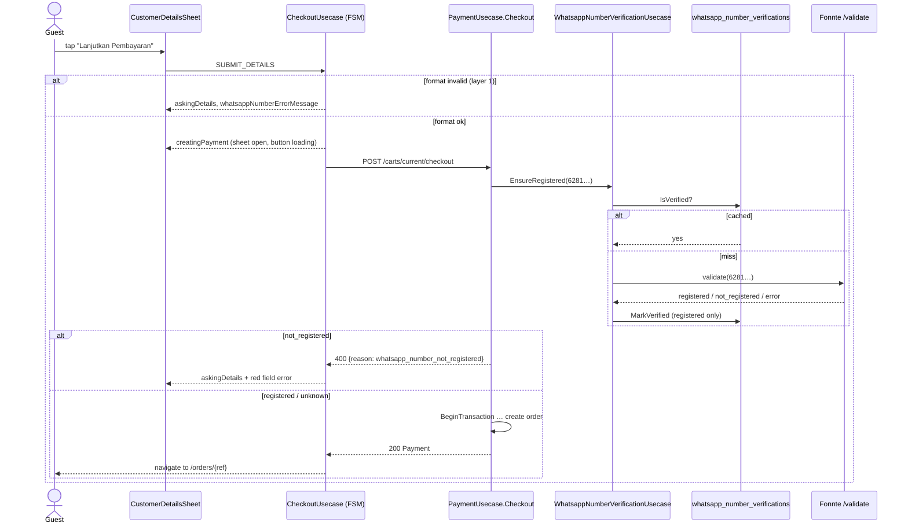
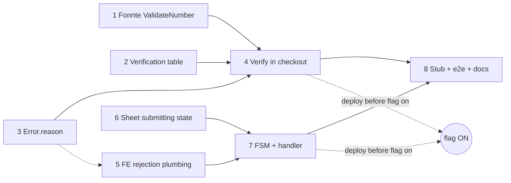

# PRD: Validate the Guest's WhatsApp Number at Order-App Checkout

**Status:** Draft for review
**Scope:** before an order is created in `apps/order-web`, reject a WhatsApp number that is badly
formatted (checked in the browser) or that has no WhatsApp account (checked by the API through
Fonnte's _Validate Number_ endpoint). Show the rejection as a red error under the **Nomor
WhatsApp** field while the details sheet stays open. Remember every number Fonnte confirms, so
the same number is never sent to Fonnte twice.
**Builds on:** [`docs/prd-order-whatsapp-notifications.md`](./prd-order-whatsapp-notifications.md).
Its D2 normalizer (`NormalizeWhatsappNumber`), D10 disabled gateway and the `customers` /
`payments.customer_whatsapp_number` columns are unchanged. This PRD adds a check in front of them.

---

## Problem Statement

A guest in `apps/order-web` taps **Pesan**, fills **Data pemesan** in `CustomerDetailsSheet`
(`libs/ui/src/presentation/views/components/checkout/CustomerDetailsSheet.tsx`), and taps
**Lanjutkan Pembayaran**. What happens next:

1. **The browser checks the format only.** `CheckoutUsecase` (`libs/ui/src/domain/usecases/checkout.ts:139`)
   runs `normalizeWhatsappNumber` from `domain/entities/Customer.ts`. That catches `08abc` or a
   number that is too short. It cannot catch `0812 3456 7809` when the guest meant
   `0812 3456 7890`. Both are well-formed Indonesian mobile numbers.
2. **The API checks the format only.** `PaymentUsecase.Checkout`
   (`apps/api/domain/payment_usecase.go:86`) runs the same rule in Go (`NormalizeWhatsappNumber`,
   `domain/whatsapp_number.go`). A well-formed number that has no WhatsApp account passes, the
   customer is upserted, the payment snapshots the number, and the order is created.
3. **The guest finds out only when it is too late.** The order is paid and prepared. The barista
   taps **Mark as ready**. `GuestNotificationUsecase` hands the number to Fonnte's `/send`,
   Fonnte rejects it, the outbox row retries up to `GuestNotificationMaxAttempts` (5) and ends as
   `failed`. The guest waits at the table for a message that never comes.
4. **The sheet closes before the server answers.** The sheet is rendered only while the FSM is in
   `askingDetails` (`CartHandler.tsx:213`). `SUBMIT_DETAILS` moves to `creatingPayment`, the sheet
   unmounts, and the spinner moves to the cart's **Bayar** button (`isCheckingOut`,
   `CartHandler.tsx:298`). Even if the API did reject the number, the field the guest has to fix is
   already gone. Every checkout failure also collapses into one generic
   `'Failed to create payment'` (`checkout.ts:197`) shown on the cart screen.

### Root cause

Nothing between the guest's keyboard and the order asks _"does this number have WhatsApp?"_.
Fonnte can answer that (`POST /validate`), but `WhatsAppGatewayRepository`
(`domain/whatsapp_gateway_repository.go`) only exposes `Send`. And even with that answer, the API
has no way to tell the order app _which field_ was wrong. The contract's `Error` has a closed
`code` enum (`bad_request`, …) and a free-text `message`.

---

## How the Industry Handles This

- **Messaging-first ordering platforms** (WhatsApp-commerce tools, Indonesian F&B QR ordering such
  as ESB/Moka-style flows) check the number _before_ the order is placed. They show an inline
  field error and keep the form open. They never let the error surface after payment.
- **WhatsApp gateway vendors** (Fonnte, Wablas, Watzap) each ship a "check number" endpoint for
  exactly this. Their docs recommend caching the result, because each check goes through the
  connected device's WhatsApp session, and heavy checking is a known trigger for device bans.
- **Checkout forms in general** check format on the client for instant feedback and check
  existence on the server, where it cannot be bypassed. If the external check fails, they
  _fail open_: a sale is never blocked because a side-channel vendor is down.

---

## Alternatives Considered

### 1. Where does the "has WhatsApp" check run?

**Option A: Inside `POST /carts/current/checkout`, before the order is created. ← Recommended**

- ✅ One round trip. The guest taps once and gets either an order or a field error.
- ✅ Cannot be bypassed. An old bundle or a hand-crafted request goes through the same check.
- ✅ No new public endpoint. The check is only reachable by a session that has a non-empty cart
  at a table, so it is a much weaker "does this number have WhatsApp?" oracle than a standalone
  endpoint (see Risks).
- ✅ Meets "the dialog should not be closed": the sheet simply stays open for the whole submit.
- ❌ The checkout request gets slower by one Fonnte call on a cache miss. It is bounded by a
  5-second budget (D6), and a cache hit costs nothing.

**Option B: A separate `POST /whatsapp-numbers/validate` called by the sheet before checkout.**

- ✅ The sheet could show "checking number…" as its own step.
- ❌ Two round trips on every checkout, and checkout itself still has to re-check (or trust the
  client), so the server logic exists twice.
- ❌ A public, session-free phone-number oracle that anyone can script to enumerate numbers and
  spend our Fonnte device's reputation.
- ❌ One more FSM state, one more repository method and one more contract operation, all for the
  same user-visible result as A.

**Option C: Validate asynchronously after the order is created, and warn on the status page.**
❌ Fails the acceptance criterion. The guest has already paid by the time they see it, and
changing the number on a paid order is a feature we don't have.

**Verdict: Option A.**

### 2. Where is a confirmed number remembered?

**Option D: A new table `whatsapp_number_verifications`, one row per normalized number. ← Recommended**

- ✅ The cache key is the thing being cached. A number verified by one session is verified for
  every session, device and table. `customers` is keyed by `session_id` (`000024_create_customers`),
  and the same guest gets a new session on a new phone or after clearing storage.
- ✅ No invalidation logic. A row means "this exact number had WhatsApp at `verified_at`". A guest
  who switches number looks up a different row. Nothing has to be reset.
- ✅ No coupling to the upsert path. `UpsertCustomerBySessionId` stays as it is.
- ❌ One more table and repository.

**Option E: `customers.whatsapp_number_verified_at`.** ❌ The cache is per session, so the same
number is re-checked for every new session. The column also has to be cleared on every number
change, and forgetting to clear it silently trusts an unverified number. Rejected: the cache key
is wrong.

**Option F: No persistence, a process-local LRU in the API.** ❌ Lost on every deploy and
restart. Fails the "store it in our database" criterion.

**Verdict: Option D.**

### 3. What happens when Fonnte can't answer?

**Option G: Fail open. Accept the number, don't cache it, log a warning. ← Recommended**

- ✅ A notification vendor being down (device disconnected, timeout, 5xx, token revoked) never
  costs us a sale. The worst case is exactly today's behaviour.
- ✅ Matches D10 of the notifications PRD: a missing `FONNTE_TOKEN` already means "WhatsApp is
  off", not "checkout is broken".
- ❌ An unverified number can get through during an outage. That is acceptable, because it is no
  worse than today.

**Option H: Fail closed, reject the checkout.** ❌ Couples order intake to a third-party
WhatsApp-Web session that we know disconnects. Rejected.

**Verdict: Option G.**

---

## System Design Overview

### The path, end to end

```
 Guest (order app)
      │  Cart → "Pesan" → CustomerDetailsSheet
      │  taps "Lanjutkan Pembayaran"
      ▼
 CheckoutUsecase  SUBMIT_DETAILS
  ├─ validateName / normalizeWhatsappNumber          ── invalid ─► askingDetails + red field error
  │                                                                (layer 1, no request sent)
  ▼
 creatingPayment   ◄── sheet STAYS OPEN, submit button shows spinner, inputs + "Batal" disabled
  │
  │ POST /carts/current/checkout { customerName, customerWhatsappNumber, method, diningOption }
  ▼
 PaymentUsecase.Checkout                                                (apps/api)
  ├─ NormalizeWhatsappNumber                ── invalid ─► 400 reason=whatsapp_number_invalid
  ├─ WhatsappNumberVerificationUsecase.EnsureRegistered(ctx, "6281…")      ◄── OUTSIDE the DB tx (D5)
  │    ├─ verificationRepository.IsVerified("6281…") ── hit ─► ok (no Fonnte call)
  │    ├─ gateway.ValidateNumber("6281…")  (5 s budget, D6)
  │    │     └─ POST api.fonnte.com/validate  target=6281…, countryCode=0
  │    ├─ registered      ─► verificationRepository.MarkVerified("6281…") ─► ok
  │    ├─ not_registered  ─► 400 reason=whatsapp_number_not_registered    (not cached, D4)
  │    └─ unknown / disabled / timeout ─► ok, log warn, not cached         (fail open, D3)
  └─ BeginTransaction { upsert customer, reuse-or-create transaction + payment, QRIS … }  (unchanged)
      │
      ▼
 200 PaymentResponse ─► created ─► router.push(/orders/{ref})   (sheet unmounts with the page)
 400 reason=whatsapp_number_* ─► WHATSAPP_NUMBER_REJECTED ─► askingDetails + red field error
 any other error ─► error ─► sheet closes, cart shows the existing error + retry (unchanged)
```



### Table design

One migration after `000042_add_transaction_dining_option`. **The number is provisional.** It
takes the next free number when it merges.

```sql
-- 000043_create_whatsapp_number_verifications.up.sql                      (phase 2)
CREATE TABLE IF NOT EXISTS `whatsapp_number_verifications` (
    `id`              BIGINT       NOT NULL AUTO_INCREMENT,
    `whatsapp_number` VARCHAR(16)  NOT NULL,                     -- normalized digits, e.g. 6281234567890 (D2 of the notifications PRD)
    `verified_at`     DATETIME     NOT NULL,                     -- when Fonnte last said "registered"
    `created_at`      DATETIME     NOT NULL DEFAULT CURRENT_TIMESTAMP,
    `updated_at`      DATETIME     NOT NULL DEFAULT CURRENT_TIMESTAMP ON UPDATE CURRENT_TIMESTAMP,
    PRIMARY KEY (`id`),
    UNIQUE KEY `uq_whatsapp_number_verifications_number` (`whatsapp_number`)
) ENGINE=InnoDB DEFAULT CHARSET=utf8mb4;

-- 000043_create_whatsapp_number_verifications.down.sql
DROP TABLE IF EXISTS `whatsapp_number_verifications`;
```

| Table                           | Columns                                                                     | Notes                                                                                                                                                             |
| ------------------------------- | --------------------------------------------------------------------------- | ----------------------------------------------------------------------------------------------------------------------------------------------------------------- |
| `whatsapp_number_verifications` | `id, whatsapp_number (UNIQUE), verified_at, created_at, updated_at`          | **Positive results only** (D4). A row's existence means "skip Fonnte". Written with `INSERT … ON DUPLICATE KEY UPDATE verified_at = VALUES(verified_at)`, so concurrent checkouts race harmlessly. |
| `customers`                     | unchanged                                                                   | Still per-session prefill (name, latest number).                                                                                                                  |
| `payments`                      | unchanged                                                                   | Still snapshots `customer_whatsapp_number`.                                                                                                                       |

No `deleted_at`: a row is a cache entry, not a business record. Deleting it only costs one extra
Fonnte call. `verified_at` is stored now, so a re-verification age (Open Question 2) can be added
later without a migration.

### API contract changes (`libs/api-contract/src/api.yaml`)

```yaml
# Error — phase 3 (additive, optional field)
Error:
  type: object
  required: [code, message]
  properties:
    code:    { $ref: '#/components/schemas/ErrorCode' }   # unchanged
    message: { type: string }                             # unchanged
    reason:                                               # NEW — machine-readable detail for a code
      $ref: '#/components/schemas/ErrorReason'
ErrorReason:
  type: string
  enum:
    - whatsapp_number_invalid          # fails the format rule (D2 of the notifications PRD)
    - whatsapp_number_not_registered   # well-formed, but Fonnte says no WhatsApp account

# POST /carts/current/checkout — phase 3 (description only; the 400 schema is already Error)
responses:
  '400':
    description: >
      validation error. `reason` is set when the guest's WhatsApp number is the problem, so the
      order app can show the error under that field.
```

| Change   | Operation / schema                                                   | Phase |
| -------- | -------------------------------------------------------------------- | ----- |
| Additive | `Error.reason` (optional), new `ErrorReason` enum                    | 3     |
| Doc only | `paymentCheckout` `400` description names the two reasons            | 3     |

Example responses:

```jsonc
// 400: well-formed, no WhatsApp account (phase 4)
{ "code": "bad_request", "message": "customerWhatsappNumber is not registered on WhatsApp", "reason": "whatsapp_number_not_registered" }
// 400: bad format that slipped past an old client (phase 3 tags the existing error)
{ "code": "bad_request", "message": "customerWhatsappNumber must be a valid WhatsApp number", "reason": "whatsapp_number_invalid" }
```

The HTTP status stays `400` and `code` stays `bad_request` (D7), so `ToHttpStatus`, `ToErrorCode`,
POS clients and old order-app bundles see nothing new. `PaymentCheckoutRequest`,
`PaymentResponse` and every other operation are unchanged.

### Fonnte `/validate` (third-party contract, phase 1)

```
POST https://api.fonnte.com/validate
Authorization: <FONNTE_TOKEN>
Content-Type: multipart/form-data
  target=6281234567890        # one number; the endpoint accepts a comma list, we send one
  countryCode=0               # we already normalized (same as Send, fonnte_repo.go)

200 {"status":true,  "registered":["6281234567890"], "not_registered":[]}
200 {"status":true,  "registered":[], "not_registered":["6281234567890"]}
200 {"status":false, "reason":"device disconnected" | "token invalid" | "target invalid" | …}
```

The response shape above follows Fonnte's docs. Phase 1 confirms it against a live device with
`go run ./cmd/fonntecheck -validate -to 0812…` and commits the real bodies as test fixtures.

### Backend components (`apps/api`)

| Layer  | File                                                               | Status  | Contents                                                                                                                                                                                              |
| ------ | ------------------------------------------------------------------ | ------- | ----------------------------------------------------------------------------------------------------------------------------------------------------------------------------------------------------- |
| Domain | `domain/whatsapp_gateway_repository.go`                            | changed | `+ WhatsAppNumberStatus = registered \| not_registered \| unknown`; `+ WhatsAppNumberValidationResult{Status, Detail}`; interface gains `ValidateNumber(ctx, number string) (WhatsAppNumberValidationResult, *Error)` |
| Domain | `domain/whatsapp_number_verification_repository.go`                | new     | `IsWhatsappNumberVerified(ctx, number) (bool, *Error)`, `MarkWhatsappNumberVerified(ctx, number, at time.Time) *Error`; `//go:generate mockgen`                                                       |
| Domain | `domain/whatsapp_number_verification_usecase.go` (+ `_test`)       | new     | `EnsureRegistered(ctx, normalized string) *Error`, the cache → gateway → persist flow and the fail-open rule (D3–D6)                                                                                  |
| Domain | `domain/base_entity.go`                                            | changed | `Error` gains `Reason ErrorReason` (zero value = none); `ErrorReasonWhatsappNumberInvalid`, `ErrorReasonWhatsappNumberNotRegistered`                                                                  |
| Domain | `domain/whatsapp_number.go`                                        | changed | `invalidWhatsappNumberError()` sets `Reason: ErrorReasonWhatsappNumberInvalid`                                                                                                                        |
| Domain | `domain/payment_usecase.go`                                        | changed | `Checkout` normalizes and calls `EnsureRegistered` **before** `BeginTransaction`; `NewPaymentUsecase` takes a `WhatsappNumberVerifier` interface                                                     |
| Data   | `data/fonnte/fonnte_repo.go` (+ `_test`)                           | changed | `ValidateNumber` → `POST /validate`; `disabledClient.ValidateNumber` returns `unknown` with `WhatsAppGatewayNotConfiguredDetail`                                                                      |
| Data   | `data/mysql/whatsapp_number_verification_{entity,repo}.go` (+ `_test`) | new | upsert on the unique key                                                                                                                                                                              |
| Data   | `data/mock/*` (generated)                                          | changed | `go generate ./...`                                                                                                                                                                                   |
| REST   | `presentation/restapi/base_transformers.go`, `payment_handler.go`  | changed | `ToErrorReason(domain.ErrorReason) *apiContract.ErrorReason`; `Checkout` handler copies it into the response                                                                                          |
| CLI    | `cmd/fonntecheck/main.go`                                          | changed | `-validate` flag: calls `ValidateNumber` and prints the raw result                                                                                                                                    |
| CLI    | `cmd/fonntestub/main.go`                                           | new     | e2e-only stub like `cmd/dokustub`: `/validate` says `not_registered` for numbers ending in `0000`, `registered` otherwise; `/send` accepts                                                           |
| Config | `utils/env.go`, `.env.example`, `deploy-api.yml`                   | changed | `+ WHATSAPP_NUMBER_VALIDATION_ENABLED` (default `false`, D8)                                                                                                                                          |
| Wiring | `main.go`                                                          | changed | build the verification usecase from `whatsappGatewayRepository` (`main.go:88`) + new repo; pass it to `NewPaymentUsecase` (`main.go:149`); a no-op verifier when the flag is off                       |

Go signatures:

```go
type WhatsappNumberVerifier interface {
    EnsureRegistered(ctx context.Context, normalizedNumber string) *Error
}

func (u WhatsappNumberVerificationUsecase) EnsureRegistered(ctx context.Context, number string) *Error {
    // 1. cache hit → nil
    // 2. ctx, cancel := context.WithTimeout(ctx, WhatsappNumberValidationTimeout) // 5 s
    // 3. gateway.ValidateNumber:
    //      registered     → MarkWhatsappNumberVerified (a write error is logged, not returned) → nil
    //      not_registered → &Error{Type: BadRequest, Reason: ErrorReasonWhatsappNumberNotRegistered, Message: …}
    //      unknown / *Error → log warn → nil   (fail open)
}
```

### Frontend architecture (`libs/ui`, `@gatherloop-pos/ui/order` graph only)

```
domain/repositories/payment.ts          + class WhatsappNumberRejectedError extends Error { reason }
                                        + type WhatsappNumberRejectionReason = 'invalid' | 'not_registered'
data/api/payment.ts                     checkout: axios 400 whose body.reason is whatsapp_number_* → throw WhatsappNumberRejectedError
data/mock/payment.ts                    + setRejectedWhatsappNumbers(numbers: string[])  (for tests/stories)
domain/usecases/checkout.ts (+ test)    FSM changes below
presentation/views/components/checkout/
  CustomerDetailsSheet.tsx (+ stories)  + isSubmitting: boolean
presentation/handlers/order/CartHandler.tsx (+ test)
                                        sheet open while askingDetails | creatingPayment | created
presentation/views/screens/order/CartScreen.tsx (+ stories)
                                        − isCheckingOut (the cart button never spins for checkout again)
```

**`CheckoutUsecase` FSM.** It stays `extends Usecase<State, Action, Params>`. The diff is one
action, one transition, and a change to what the context holds:

```
Context:  whatsappNumber            = what the guest typed (NO LONGER overwritten with the normalized form)
          whatsappNumberErrorMessage  (unchanged field, new sources)

Actions:  + WHATSAPP_NUMBER_REJECTED { reason: 'invalid' | 'not_registered' }

                         CHANGE_NAME / CHANGE_WHATSAPP_NUMBER (clears that field's error) / CHANGE_METHOD / CHANGE_DINING_OPTION
                            ┌───┐
                            ▼   │
idle ──ASK_DETAILS──► askingDetails ──SUBMIT_DETAILS (valid)──► creatingPayment ──CHECKOUT_SUCCESS──► created
  ▲                     │  ▲   │                                   │   │
  └──CANCEL_DETAILS─────┘  │   └─SUBMIT_DETAILS (invalid): stay,   │   └──CHECKOUT_ERROR──► error ──SUBMIT_DETAILS──► creatingPayment
                           │     set field errors (layer 1)        │                          (retry from cart, unchanged)
                           └─────WHATSAPP_NUMBER_REJECTED──────────┘   NEW (layer 2): back to the sheet,
                                                                         whatsappNumberErrorMessage set
```

`onStateChange` for `creatingPayment` sends `normalizeWhatsappNumber(whatsappNumber)` and routes
the rejection:

```ts
.catch((error) =>
  error instanceof WhatsappNumberRejectedError
    ? dispatch({ type: 'WHATSAPP_NUMBER_REJECTED', reason: error.reason })
    : dispatch({ type: 'CHECKOUT_ERROR', message: 'Failed to create payment' })
);
```

Error copy (Bahasa Indonesia, under the field in `$red10`, the existing style):

| Source                     | Message                                                                        |
| -------------------------- | ------------------------------------------------------------------------------ |
| Layer 1, empty             | `Nomor WhatsApp tidak boleh kosong` (unchanged)                                |
| Layer 1, bad format        | `Nomor WhatsApp tidak valid. Mohon periksa kembali.`                           |
| Layer 2, `invalid`         | `Nomor WhatsApp tidak valid. Mohon periksa kembali.`                           |
| Layer 2, `not_registered`  | `Nomor WhatsApp tidak terdaftar di WhatsApp. Mohon periksa kembali.`           |

**The sheet while submitting:**

```
┌──────────────────────────────────────────────┐
│  Data pemesan                                │
│  ┌────────────────────────────────────────┐  │
│  │ Andi                                   │  │  disabled
│  └────────────────────────────────────────┘  │
│  ┌────────────────────────────────────────┐  │
│  │ 0812 3456 7809                         │  │  disabled
│  └────────────────────────────────────────┘  │
│  … dining option / method (disabled) …       │
│  [  ◌  Memproses…                        ]   │  ← spinner HERE, button disabled
│  [            Batal            ]  disabled   │  swipe-down / backdrop dismiss ignored
└──────────────────────────────────────────────┘

        ── 400 whatsapp_number_not_registered ──►

│  ┌────────────────────────────────────────┐  │
│  │ 0812 3456 7809                         │  │  enabled, value kept as typed
│  └────────────────────────────────────────┘  │
│  Nomor WhatsApp tidak terdaftar di WhatsApp. │  ← red ($red10)
│  Mohon periksa kembali.                      │
│  [   Lanjutkan Pembayaran   ]                │
```

---

## Proposed Solution

### FR-1: Layer 1, format in the browser (exists, copy tweak only)

`CheckoutUsecase`'s `SUBMIT_DETAILS` keeps rejecting an empty or malformed number with no request
sent. The bad-format copy gains "Mohon periksa kembali." to match the acceptance criterion.

### FR-2: Layer 2, WhatsApp account on the server

`PaymentUsecase.Checkout` calls `WhatsappNumberVerifier.EnsureRegistered` with the normalized
number whenever one is given. An absent number (an old bundle, D5 of the notifications PRD) skips
the check, as it skips the upsert today. A `not_registered` answer returns `400` with
`reason = whatsapp_number_not_registered`, and nothing is written: no customer upsert, no
transaction, no payment.

### FR-3: Remember confirmed numbers

A `registered` answer upserts `whatsapp_number_verifications`. The next checkout with that number
from any session skips Fonnte. `not_registered` and `unknown` answers are never stored (D4).

### FR-4: Fail open

If Fonnte doesn't answer in 5 s, returns `status:false`, returns a non-2xx, or the gateway is the
D10 disabled client, checkout proceeds as it does today. The number is not cached, and one `WARN`
log records `whatsapp number validation unavailable` with the detail.

### FR-5: The sheet stays open through the whole submit

The sheet renders while the FSM is `askingDetails`, `creatingPayment` or `created`. In
`creatingPayment` the submit button shows a spinner, and the inputs and **Batal** are disabled.
Dismissing the sheet does nothing, and the FSM already ignores `CANCEL_DETAILS` outside
`askingDetails`. In `created` it stays up until `router.push` replaces the page, so the cart never
flashes. The cart's **Bayar** button loses its `isCheckingOut` spinner.

### FR-6: The rejection lands on the field

`WHATSAPP_NUMBER_REJECTED` returns the FSM to `askingDetails` with the field error set and the
guest's input intact. Typing in the field clears the error. Any other failure keeps today's path:
`error` state, sheet closed, cart error with retry, cart re-fetch.

### FR-7: Kill switch

`WHATSAPP_NUMBER_VALIDATION_ENABLED=false` (the default) wires a no-op verifier. Checkout then
behaves exactly as it does before this PRD. The flag is turned on only after the phase-7 bundle is
live (see Rollout Notes).

---

## Design decisions

**D1. Check inside checkout, not in a separate endpoint.** See Alternatives §1. The check runs in
the only request that can create an order, so it cannot be skipped. It is also not a free,
session-less number oracle.
_Alternative rejected:_ `POST /whatsapp-numbers/validate` (Option B).

**D2. Cache in `whatsapp_number_verifications`, keyed by the normalized number.** See Alternatives
§2. The normalizer (D2 of the notifications PRD) guarantees one spelling per number, so the unique
key works as the cache key.
_Alternative rejected:_ `customers.whatsapp_number_verified_at` (per-session key, needs
invalidation).

**D3. Fail open on anything but a definite `not_registered`.** See Alternatives §3. Only a
positive statement from Fonnte that the number has no WhatsApp blocks a checkout.

**D4. Cache positive results only.** A negative is cheap to re-ask, and it can change: the guest
installs WhatsApp, or Fonnte had a transient false negative. Caching it would lock a real guest out
for the life of the entry. Caching positives is safe for our purpose. Worst case, a number loses
WhatsApp later and the ready-notification fails, which is today's behaviour.
_Alternative rejected:_ caching negatives with a short TTL. It adds a column and a clock for no
cost saving we need, since a guest who typo'd re-submits a _different_ number anyway.

**D5. Verify before `BeginTransaction`, never inside it.** `Checkout` holds a MySQL transaction
(`payment_usecase.go:91`) across the cart read, the availability reservation and the payment
insert. A Fonnte call inside it would hold those row locks for up to 5 s per checkout.
Normalization moves out with it, because it is pure. The DOKU QRIS call already inside the
transaction is out of scope here.

**D6. A 5-second budget for `/validate`, separate from `Send`'s 15 s.** The guest is watching a
spinner, while `Send` runs in a background dispatcher. `EnsureRegistered` derives its own
`context.WithTimeout`, so the Fonnte client's shared `http.Client` timeout does not change.

**D7. Signal the field with `Error.reason`, not a new status or `code`.** `code` is derived from
`domain.ErrorType` in `ToErrorCode` at every handler. A new `code` would need a new
`ErrorType` per business reason, and a new status would need `ToHttpStatus` changes. An optional
`reason`, set by the domain and copied by the one handler that needs it, is additive. Old clients
ignore it, and other endpoints can reuse it later.
_Alternative rejected:_ matching `message` text on the client (breaks on any copy edit).
_Alternative rejected:_ `422 Unprocessable Entity` (every other validation failure in this API is
`400`; a status alone can't say _which_ field).

**D8. An env kill switch, default off.** The check can block a sale on a false negative, and it
depends on an unofficial WhatsApp-Web session. Operations must be able to turn it off with a
restart, without a code revert, and it must stay off until the order app can render the error
(Rollout Notes).

**D9. The sheet owns the whole submit.** The acceptance criterion asks for the spinner in the
sheet "when checking the WA number". With D1 the check and the order creation are one request, so
the sheet stays open for all of it. The alternative is a sheet that stays open for part of a
request it cannot see into.

**D10. The FSM keeps the raw input and normalizes on send.** Today `SUBMIT_DETAILS` overwrites
`whatsappNumber` with `6281…` (`checkout.ts:156`). Returning to the field would then show the guest
a number they never typed. Normalizing in `onStateChange` keeps the input as typed.

---

## Phased plan

Every phase is one PR, leaves `main` green, and ships on its own. Nothing is user-visible until
phase 7 is deployed **and** the flag is turned on.

### Phase 1: Fonnte `ValidateNumber` (API)

`WhatsAppGatewayRepository.ValidateNumber` + result types; the Fonnte client's `POST /validate`
with an `httptest` table test (registered, not_registered, `status:false`, non-2xx, bad JSON,
dial error → `unknown`); the disabled client returns `unknown`; `go generate` the mock;
`fonntecheck -validate`. No caller yet.
**Files:** `domain/whatsapp_gateway_repository.go`, `data/fonnte/fonnte_repo{,_test}.go`,
`data/mock/whatsapp_gateway_repository.go`, `cmd/fonntecheck/main.go`.
**Acceptance:** `npx nx run api:test` green. `fonntecheck -validate -to <own number>` against the
real device prints `registered`, and the raw body is committed as a fixture.

### Phase 2: Verification cache table and repository (API)

Migration `000043`, domain repository interface, MySQL repo with idempotent upsert, integration
test (insert, re-insert updates `verified_at`, unknown number → false), mock.
**Files:** `data/mysql/migrations/000043_*`, `domain/whatsapp_number_verification_repository.go`,
`data/mysql/whatsapp_number_verification_{entity,repo,repo_test}.go`, `data/mock/…`.
**Acceptance:** `make migrate-up` then `migrate-down 1` round-trip cleanly; repo test green.

### Phase 3: `Error.reason` in the contract and Go plumbing (contract + API)

`api.yaml` `Error.reason` + `ErrorReason`; `domain.Error.Reason`; `ToErrorReason`; the `Checkout`
handler copies it; `invalidWhatsappNumberError()` gets `whatsapp_number_invalid`. Regenerate Go
and TS clients. Add `ErrorReason` to `libs/ui/src/__mocks__/api-contract.ts` if the UI imports it.
**Files:** `libs/api-contract/src/api.yaml`, `domain/base_entity.go`, `domain/whatsapp_number.go`,
`presentation/restapi/{base_transformers,payment_handler}.go` (+ handler test).
**Acceptance:** a checkout with `customerWhatsappNumber: "08abc"` returns `400` with
`"reason":"whatsapp_number_invalid"`; every other error body is byte-identical (no `reason` key).

### Phase 4: Verify in checkout (API)

`WhatsappNumberVerificationUsecase` + table test (cache hit skips gateway, registered persists,
not_registered → reason, unknown / timeout / gateway `*Error` / disabled → nil, persist failure
still nil); `Checkout` normalizes and verifies before `BeginTransaction`; the
`WHATSAPP_NUMBER_VALIDATION_ENABLED` flag; `main.go` wiring; `payment_usecase_test.go` cases (a
rejected number writes nothing, no number skips the verifier, the idempotent pending-payment path
is verified too).
**Files:** `domain/whatsapp_number_verification_usecase{,_test}.go`, `domain/payment_usecase{,_test}.go`,
`utils/env.go`, `.env.example`, `.github/workflows/deploy-api.yml`, `main.go`.
**Acceptance:** `api:test` green; with the flag off, `payment_usecase_test.go`'s existing cases pass
unchanged.

### Phase 5: Frontend rejection plumbing (libs/ui)

`WhatsappNumberRejectedError` in `domain/repositories/payment.ts` (+ barrel);
`ApiPaymentRepository.checkout` maps an axios `400` whose `response.data.reason` is
`whatsapp_number_invalid | whatsapp_number_not_registered`. It reads the string off the response
body, so it doesn't need phase 3's generated type. `MockPaymentRepository.setRejectedWhatsappNumbers`.
**Files:** `domain/repositories/{payment,index}.ts`, `data/api/payment.ts`, `data/mock/payment.ts`.
**Acceptance:** `npx nx run ui:test` green; a unit test on the API repo's error mapping.

### Phase 6: `CustomerDetailsSheet` submitting state (libs/ui, view only)

`isSubmitting` prop: spinner and **Memproses…** on the submit button; inputs, choice buttons and
**Batal** disabled; `onOpenChange` ignored while submitting. Stories: _Submitting_,
_WhatsApp not registered_. `CartHandler` passes `isSubmitting={false}` for now.
**Files:** `CustomerDetailsSheet{,.stories}.tsx`, `CartHandler.tsx` (one prop).
**Acceptance:** Storybook shows both new stories; `ui:test` and lint green.

### Phase 7: Checkout FSM and handler (libs/ui)

`WHATSAPP_NUMBER_REJECTED`; raw input kept (D10); field error cleared on change; copy updates;
`onStateChange` routing. `CartHandler` keeps the sheet open for
`askingDetails | creatingPayment | created` and passes `isSubmitting`. `CartScreen` drops
`isCheckingOut` (+ stories).
**Files:** `domain/usecases/checkout{,.test}.ts`, `presentation/handlers/order/CartHandler{,.test}.tsx`,
`presentation/views/screens/order/CartScreen{,.stories}.tsx`.
**Acceptance:** usecase test covers both reasons and the raw-input rule via `UsecaseTester`;
handler test (real `CheckoutUsecase` over `MockPaymentRepository`) asserts the sheet's submit
button is busy during submit, and that the error text `role`-queries under the field after
rejection. Existing `checkout.spec.ts` e2e still passes locally (flag off ⇒ no behaviour change).

### Phase 8: Stub, e2e and docs

`cmd/fonntestub`; `e2e-main.yml` builds and starts it, points `FONNTE_BASE_URL` at it and sets
`WHATSAPP_NUMBER_VALIDATION_ENABLED=true`; a new `whatsappNumberValidation.spec.ts` (an
unregistered number shows the red text and the sheet stays open; a fixed number checks out; a
second checkout with the same number makes no stub call, asserted through the stub's
`/_stub/calls` counter); `docs-site/sales/order-notifications.md` gains a "Nomor WhatsApp
diperiksa" section.
**Files:** `apps/api/cmd/fonntestub/main.go`, `.github/workflows/e2e-main.yml`,
`apps/order-web-e2e/src/{whatsappNumberValidation.spec.ts,utils/fonnteStub.ts,utils/selectors.ts}`,
`docs-site/sales/order-notifications.md`.
**Acceptance:** `npx nx e2e order-web-e2e` green locally with the stub; the docs-site builds.

---

## Phase dependencies

**Hard** means the phase does not compile, or its tests fail, without the other. **Soft** means it
builds green alone but wants the other first.

| #   | Phase                             | Hard deps | Soft deps                          | Primary files it owns                                                                 |
| --- | --------------------------------- | --------- | ---------------------------------- | ------------------------------------------------------------------------------------- |
| 1   | Fonnte `ValidateNumber` (API)      | —         | —                                  | `whatsapp_gateway_repository.go`, `data/fonnte/**`, `cmd/fonntecheck`                |
| 2   | Verification table + repo (API)   | —         | —                                  | migration `000043`, `whatsapp_number_verification_repository.go`, `data/mysql/whatsapp_number_verification_*` |
| 3   | `Error.reason` (contract + API)   | —         | —                                  | `api.yaml` `Error`, `base_entity.go`, `base_transformers.go`, `payment_handler.go`    |
| 4   | Verify in checkout (API)          | 1, 2, 3   | —                                  | `whatsapp_number_verification_usecase.go`, `payment_usecase.go`, `env.go`, `main.go`  |
| 5   | FE rejection plumbing (UI)        | —         | 3 _(values fixed by this PRD)_     | `domain/repositories/payment.ts`, `data/{api,mock}/payment.ts`                        |
| 6   | Sheet submitting state (UI)       | —         | —                                  | `CustomerDetailsSheet{,.stories}.tsx`                                                 |
| 7   | Checkout FSM + handler (UI)       | 5, 6      | —                                  | `checkout.ts`, `CartHandler.tsx`, `CartScreen.tsx`                                    |
| 8   | Stub + e2e + docs                 | 4, 7      | —                                  | `cmd/fonntestub`, `e2e-main.yml`, order-web-e2e spec, docs-site page                  |



Solid arrows are hard dependencies. Dotted arrows are soft or deploy-order constraints.

### What can run in parallel

| Wave | Phases              | Why they don't collide                                                                                                                                                                  |
| ---- | ------------------- | --------------------------------------------------------------------------------------------------------------------------------------------------------------------------------------- |
| 1    | **1, 2, 3, 5, 6**   | Five disjoint slices: the Fonnte client; a new table and repo; the error envelope; the FE repository layer; one view component. Overlaps are append-only (`data/mock/`, barrel lines). |
| 2    | **4, 7**            | 4 is Go (the checkout use case and wiring); 7 is TypeScript (the FSM and handler). No shared file.                                                                                      |
| 3    | **8**               | Alone. Its e2e spec drives 4 and 7 together.                                                                                                                                            |

**Critical path: 1 (or 2 or 3) → 4 → 8** and **5 (or 6) → 7 → 8**. Both are three PRs long, so
two people (one Go, one TypeScript) finish in three rounds of review.

Notes for whoever sequences the PRs:

- **The migration takes its number at merge time.** If another feature lands `000043` first,
  phase 2 renames its pair to the next free number.
- **Phases 3 and 4 both touch Go error handling** (`base_entity.go` in 3, and 4 constructs a
  `Reason`), which is why 4 hard-depends on 3.
- **One person building alone:** merge in numeric order. It is a valid topological sort.

---

## Rollout Notes

1. Merge and deploy phases 1–4 with `WHATSAPP_NUMBER_VALIDATION_ENABLED=false`. There is no
   behaviour change. The `000043` migration is applied by `make migrate-up` in the deploy
   (CLAUDE.md: nothing runs migrations at boot).
2. Deploy phase 7's `apps/order-web` (Vercel). The sheet now owns the spinner. With the flag off,
   no `reason` ever arrives, so nothing else changes.
3. Turn the flag on (`deploy-api.yml` secret/var + API restart). **Never before step 2 is live.**
   An old bundle would get a `400` it can only show as the generic cart error, with the sheet
   already closed, which is today's problem in a worse form.
4. Watch the `WARN whatsapp number validation unavailable` rate and the count of
   `whatsapp_number_not_registered` responses for a week. A spike in the latter with complaints
   means false negatives: flip the flag off.

## Rollback

- **Behaviour:** set the flag to `false` and restart the API. Checkout is exactly as before this PRD.
- **Frontend:** reverting phase 7 is safe at any time. The API only sends `reason` on a `400`,
  and the old FSM shows it as the generic error.
- **Schema:** `000043` down drops a cache table that nothing but the verifier reads.

---

## Risks

1. **False negatives block a real guest.** If Fonnte says `not_registered` for a number that has
   WhatsApp, the guest cannot order with it. _Mitigation:_ D4 (negatives never cached, so a retry
   re-asks), D8 (kill switch), the Rollout Notes step 4 metric, and Open Question 1.
2. **Device ban from checking numbers.** Fonnte drives a WhatsApp-Web session on our device, and
   bulk "is on WhatsApp" lookups are a known ban signal. _Mitigation:_ positives are cached
   forever (D2/D4), and D1 limits checks to sessions with a real cart at a table. At our volume
   (single-venue orders), a check happens at most once per new number.
3. **A slower checkout on a cache miss.** Up to 5 s (D6) on the first order with a new number.
   _Mitigation:_ the spinner is where the guest is looking (D9), and every later order with that
   number is a DB lookup.
4. **A phone-number oracle.** A scripted client with a valid table session can still learn whether
   a number has WhatsApp. _Mitigation:_ it has to build a cart first, and each probe counts as a
   checkout attempt in the logs. A per-session rate limit is deferred (Out of Scope).
5. **Fonnte's `/validate` shape differs from its docs.** _Mitigation:_ phase 1's acceptance check
   runs against the live device before anything depends on it. Unparseable means `unknown`, which
   means fail open.

## Out of Scope

- Validating numbers entered in the POS or mobile apps. They don't collect guest WhatsApp numbers.
- Re-verifying a cached number after N days (see Open Question 2; `verified_at` makes it a
  one-line change later).
- A "continue without WhatsApp notification" escape hatch for rejected numbers (see Open Question 1).
- Per-session or per-IP rate limiting of checkout.
- Moving the DOKU QRIS call out of the checkout transaction (D5 notes it; separate change).
- Feeding `/send` rejections back into `whatsapp_number_verifications`.

## Open Questions

1. **Should a guest whose number is rejected be able to order anyway, without the notification?**
   Recommendation: not in v1. The acceptance criterion is to _stop_ the order. Revisit if the
   step-4 metric shows false negatives.
2. **Should positives expire?** Indonesian operators recycle inactive numbers. Recommendation:
   never expire in v1. A recycled number that lost WhatsApp only means a failed notification,
   which is today's behaviour.
3. **Does `/validate` count against our Fonnte plan's quota, or is it restricted to some plans?**
   To confirm with the Fonnte dashboard during phase 1. It doesn't change the design, because
   caching bounds the call count either way.

## Success Criteria

- Of the orders placed after the flag is on, the share of `guest_notifications` rows ending
  `failed` with a Fonnte "not registered"-style detail drops to ~0.
- p95 checkout latency rises by < 300 ms. Cache hits dominate after the first week.
- Zero checkouts blocked while Fonnte is down: every `unknown` is followed by a created order.

## Sources

- Fonnte, _API Validate Number_: https://docs.fonnte.com/api-validate-number/
- Fonnte, _Sending API Messages_: https://docs.fonnte.com/api-send-message/
- [`docs/prd-order-whatsapp-notifications.md`](./prd-order-whatsapp-notifications.md): D2
  (normalizer), D5 (number optional in the contract), D10 (disabled gateway).
