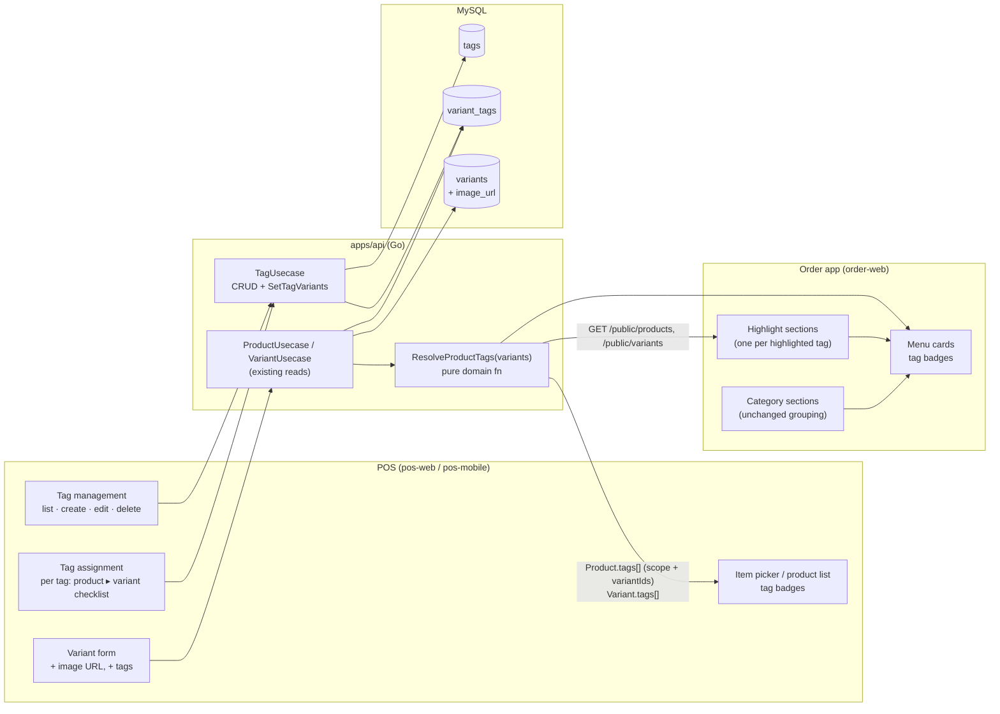
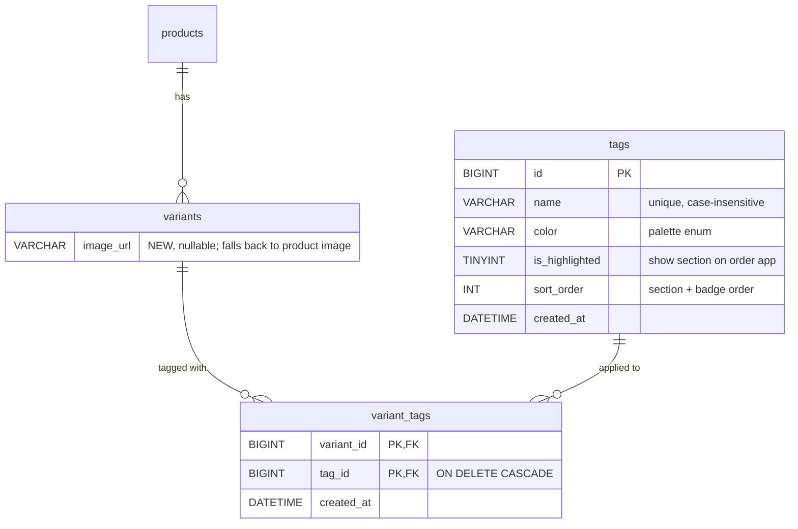
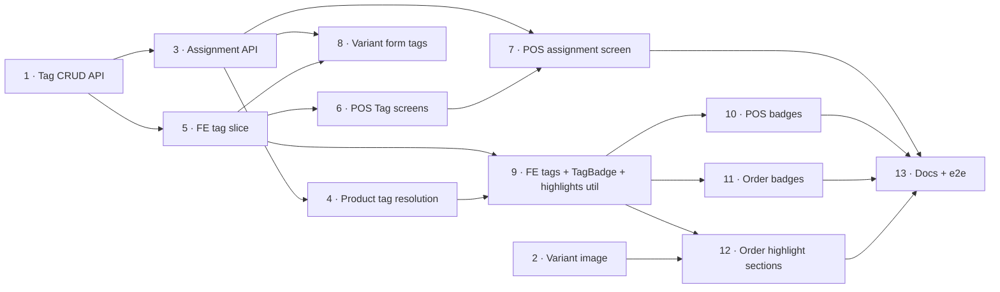

# PRD: Product Tags — "Best Seller", "New", and Highlighted Menu Sections

## Problem Statement

The shop regularly has menu items it wants customers to notice first — a new Pancong topping, a
new seasonal drink, the coffee that sells the most. Today there is no way to say so anywhere in
the system:

- **No tag concept exists.** A `Product` (`apps/api/domain/product_entity.go`) carries a single
  `Category`, a `Status` (draft/published) and availability fields; a `Variant`
  (`apps/api/domain/variant_entity.go`) carries price, materials, option values and availability.
  Nothing can mark either as "new" or "best seller".
- **The order app menu is category-only.** `MenuListHandler.groupByCategory`
  (`libs/ui/src/presentation/handlers/order/MenuListHandler.tsx`) turns the fetched products into
  one group per category, and `MenuListScreen` renders those groups top to bottom. The customer
  has no recommendation and cannot tell which items are new.
- **The product cards have nowhere to say it.** `MenuProductCard`
  (`libs/ui/src/presentation/views/components/menu/MenuProductCard.tsx`) shows image, name, a
  sold-out badge, search-match chips, description and starting price. The POS item picker's
  `ProductListItem` (`libs/ui/src/presentation/views/components/products/ProductListItem.tsx`)
  shows category, sale type, status and availability badges. Staff can't see it either.
- **A variant has no image.** `variants` (`000001_initial_schema.up.sql`) has no `image_url`;
  only `products.image_url` exists. A "New: Pancong Ice Cream" card can only show the generic
  Pancong photo.

### Root cause

"New" and "best seller" are facts about **what the customer can order**, and in this system what
the customer orders is a **variant** — the cart and the transaction both hold `variantId`, and a
product must have at least one variant to be sold at all. But the way people *talk* about these
facts is at whatever level is natural: "Coffee Latte is a best seller" (product), "the Ice Cream
Pancong is new" (one variant), "Salted Caramel Macchiato is new" (a product whose single
`Original` variant only exists because the system requires one).

Any design has to store the fact at one level and *display* it at the level that is true. The
three cases from the brief are the test:

| # | Item | Variants | What must be true on screen |
| --- | --- | --- | --- |
| 1 | **Pancong** | Choco, Matcha, Vanilla, **Ice Cream** | Pancong is **not** new. The Ice Cream variant **is** new, and the "New" section shows a *Pancong · Ice Cream* card with the Ice Cream image. |
| 2 | **Salted Caramel Macchiato** | Original (only one) | The **product** is new. The "New" section shows the product card, not a variant card. The admin never has to think about "Original". |
| 3 | **Coffee Latte** | Hot, Iced | The **product** is a best seller (both temperatures). The "Best Seller" section shows one Coffee Latte card, not two. |

---

## How the Industry Handles This

Observed patterns in food-ordering products (from product use, not independently re-verified for
this PRD — treat as background, not as a spec):

1. **Delivery marketplaces put a curated/popular strip above the category menu.** GoFood,
   GrabFood and ShopeeFood merchant pages open with a "Terlaris / Best seller / Popular" block
   before the categories. Items in that block are *duplicated*, not moved — they still appear
   under their own category.
2. **Badges are short, coloured pills on the item card**, usually one or two ("Baru", "Terlaris",
   "Pedas"). More than two becomes noise.
3. **Merchant-side, tags are a small managed list** (Square Online item labels, Shopify product
   tags/collections): the merchant creates the label once and applies it to many items.
4. **Marketplaces badge the orderable unit.** When one flavour of a dish is promoted, the
   promoted card is that flavour, with its own photo and price.

Pattern 1 and 4 together are exactly case 1: the highlighted card is the variant, the regular
menu still shows the product.

---

## Alternatives Considered

### Option A — Tags on products only ❌

`product_tags(product_id, tag_id)`.

- ✅ Simplest possible model and UI; covers cases 2 and 3 directly.
- ❌ **Cannot express case 1.** Tagging Pancong "New" would claim Choco/Matcha/Vanilla are new —
  the exact thing the brief says must not happen. Workaround (split Ice Cream into its own
  product) breaks the option picker, availability counters and reporting.

### Option B — Tags on products *and* variants (two join tables) ❌

`product_tags` means "the whole product, including future variants"; `variant_tags` means "only
this variant".

- ✅ Stores the admin's words literally ("the product is new").
- ❌ **Two sources of truth for one fact.** Coffee Latte could be tagged at product level *and*
  Hot at variant level; every reader needs a precedence rule, and the admin UI needs to explain
  the difference between "tag the product" and "tag all its variants" — which look identical today
  and diverge silently later.
- ❌ **Inheritance is wrong half the time.** A product-level "New" inherited by a variant added
  next month is right; a product-level "Best Seller" inherited by a brand-new Oat Milk variant is
  a false claim shown to customers.

### Option C — Tags on option values (e.g. the "Ice Cream" topping value) ❌

- ✅ Matches how the customer picks.
- ❌ Breaks for multi-option products — "Ice Cream" × "Large" is one variant, two option values;
  which one carries "New"?
- ❌ Does nothing for cases 2 and 3 without a product-level table as well (→ Option B's problems).

### Option D — Tags on variants only; product-level is *derived* ✅ **Recommended**

One join table, `variant_tags(variant_id, tag_id)`. A product "has" a tag at product scope when
**every live variant** carries it; otherwise it has the tag at variant scope, naming which
variants. The derivation is a pure function on the server, exposed on every product read.

- ✅ **One source of truth**, stored at the level the system actually sells.
- ✅ All three cases fall out with **no special-casing**: Ice Cream only → variant scope; one of
  one → product scope; two of two → product scope (see the table below).
- ✅ **Never shows a claim nobody made.** A variant added later carries no tag until someone
  gives it one (D4) — and the create-variant form pre-fills the product's current product-scope
  tags so the admin makes that call consciously, in one glance.
- ✅ The admin UI can still *feel* product-level: a tri-state product checkbox ticks all variants,
  and single-variant products never show their variant at all (D14).
- ⚠ Trade-off: "product scope" is a computed state, so adding an untagged variant to Coffee Latte
  demotes it from one product card to per-variant cards in the Best Seller section. Accepted —
  that is the truthful display, and D4's pre-fill makes it the admin's explicit choice.

---

## Proposed Solution

### High-level system design



**In one paragraph:** admins manage a small list of **tags** (name, colour, "show as a section on
the order app", sort order) and attach them to **variants**. Every product read runs a pure
`ResolveProductTags` over the product's variants and returns `Product.tags[]`, each entry saying
whether the tag applies to the **whole product** or only to **specific variants**. Both apps
render badges from that one field. The order app additionally builds one **highlight section per
highlighted tag**, above the category sections, from data it already fetches — a product-scope
entry becomes a product card, a variant-scope entry becomes a card for that variant, with its own
image and price, which opens the detail sheet with that variant's options pre-selected.

### Data model



| Table | Change |
| --- | --- |
| `tags` | **New.** `id`, `name VARCHAR(100) NOT NULL` + `UNIQUE (name)` (the default utf8mb4 collation makes it case-insensitive), `color VARCHAR(20) NOT NULL DEFAULT 'gray'`, `is_highlighted TINYINT(1) NOT NULL DEFAULT 0`, `sort_order INT NOT NULL DEFAULT 0`, `created_at`. |
| `variant_tags` | **New.** `PRIMARY KEY (variant_id, tag_id)`, `KEY (tag_id)`, FK to `variants`, FK to `tags` `ON DELETE CASCADE`, `created_at`. |
| `variants` | **New column** `image_url VARCHAR(255) NULL`. |

### The three cases, expressed

| Item | `variant_tags` rows | Resolved `Product.tags` | Order app "highlight" card |
| --- | --- | --- | --- |
| **Pancong** | (Ice Cream, New) | `[{ tag: New, scope: variant, variantIds: [IceCream] }]` | **Pancong · Ice Cream** — Ice Cream image, Ice Cream price; opens detail with *Ice Cream* pre-selected |
| **Salted Caramel Macchiato** | (Original, New) | `[{ tag: New, scope: product, variantIds: [Original] }]` | **Salted Caramel Macchiato** — product image, starting price |
| **Coffee Latte** | (Hot, Best Seller), (Iced, Best Seller) | `[{ tag: Best Seller, scope: product, variantIds: [Hot, Iced] }]` | **Coffee Latte** — one card, product image, starting price |

And in the regular category list:

| Item | Card badges |
| --- | --- |
| **Pancong** | `New · Ice Cream` (variant-scope pill naming the variant) — Pancong itself is *not* badged "New" |
| **Salted Caramel Macchiato** | `New` |
| **Coffee Latte** | `Best Seller` |

### Resolution rule

```
ResolveProductTags(variants []Variant) []ProductTag
  live      := variants where DeletedAt == nil
  for each tag T appearing on any live variant:
    tagged  := live variants carrying T
    scope   := "product" if len(tagged) == len(live) else "variant"
    emit { Tag: T, Scope: scope, VariantIds: ids(tagged) }
  sort by T.SortOrder, then T.Name
```

Coverage counts **live** variants, not **sellable** ones (D2): Coffee Latte stays a product-scope
best seller while Iced is sold out.

---

## Feature Requirements

### FR-1 — Tag management (POS)

A **Tags** entry in the POS sidebar, beside Categories, opens a list screen with create, edit and
delete, shaped exactly like the existing Category screens (`CategoryListScreen`,
`CategoryCreateScreen`, `CategoryUpdateScreen`). Fields:

| Field | Input | Rule |
| --- | --- | --- |
| Name | text | required, 1–100 chars, unique ignoring case |
| Colour | swatch picker | one of `red, orange, yellow, green, blue, purple, pink, gray` (D5) |
| Show as section on order app | switch | `is_highlighted` |
| Sort order | number | lower first; orders both sections and badges |

Delete asks for confirmation and states how many variants carry the tag; it removes the tag and
its assignments (D9).

API: `GET /tags`, `POST /tags`, `GET /tags/{tagId}`, `PUT /tags/{tagId}`, `DELETE /tags/{tagId}`,
all under `CheckAuth`. `Tag` schema: `id, name, color, isHighlighted, sortOrder, createdAt`.

### FR-2 — Tag assignment (POS)

From a tag's row, **Assign products** opens one screen per tag: every product, grouped by
category, searchable, with a checkbox per product and — for products with ≥ 2 variants — an
expandable checklist of its variants (D14).

- The product checkbox is **tri-state**: checked (all live variants tagged), indeterminate (some),
  unchecked (none). Ticking it ticks every variant; unticking clears them.
- A **single-variant product shows only the product checkbox** — the admin tags "Salted Caramel
  Macchiato", never "Original".
- One **Save** sends the full set: `PUT /tags/{tagId}/variants` with `{ variantIds: [...] }`,
  replacing that tag's assignments (D10).

Data for the screen comes from the existing `GET /variants` (no `limit` = all rows,
`GetLimit` in `apps/api/presentation/restapi/base_transformers.go`), each variant now carrying
`tags` and its `product`; the screen groups by product client-side.

### FR-3 — Variant form: image and tags (POS)

`VariantFormView` gains:

- **Image URL** (optional) — same text field as the product form's `imageUrl`
  (`ProductFormView.tsx:126`). Empty means "use the product image".
- **Tags** — multi-select of all tags. On **create**, pre-filled with the tags that are currently
  **product-scope** on the parent product (D4), so adding "Oat Milk" to a best-selling Coffee Latte
  asks the admin, visibly, whether it is a best seller too.

`VariantRequest` gains optional `imageUrl` and `tagIds`; **omitted `tagIds` leaves assignments
alone** (D10), so older clients and other edit paths never wipe tags.

### FR-4 — Tags on every product and variant read (API)

| Schema | New field |
| --- | --- |
| `Variant` | `tags: Tag[]`, `imageUrl?: string` |
| `Product` | `tags: ProductTag[]` where `ProductTag = { tag: Tag, scope: 'product' \| 'variant', variantIds: int64[] }` |

Populated on the authenticated and the public endpoints alike, computed by
`ResolveProductTags` (D3) at the same point `ProductUsecase.resolveAvailability`
(`apps/api/domain/product_usecase.go:16`) already loads the product's variants — the variant query
preloads `Tags`, adding no extra round trip per product.

### FR-5 — Badges on product cards (POS and order app)

One shared `TagBadge` component (coloured pill, colour from the tag's palette value, readable in
light and dark). Rules, identical in both apps:

- Product-scope tags → pill with the tag name (`Best Seller`).
- Variant-scope tags → pill with tag and variant name (`New · Ice Cream`); if more than one
  variant, `New · 2 varian`.
- At most **2** pills, in tag sort order, then `+N` (D12).
- Placement: POS `ProductListItem` subtitle (next to the sold-out/remaining badges — used by both
  the product list and the transaction item picker); order app `MenuProductCard` under the name.
- In the order app detail sheet, once a variant resolves, its own tags show beside the price.

### FR-6 — Highlight sections on the order app menu

Above the category groups, one section per tag with `isHighlighted = true` that has at least one
entry, ordered by `sortOrder`:

- **Header**: tag name (e.g. "Best Seller", "New").
- **Body**: a horizontal carousel of compact cards (image on top, name, optional variant name,
  price), so two sections don't push the regular menu off the first screen (D7).
- **Entries**, built from the `products` and `variants` the menu already loads
  (`ApiMenuRepository.fetchMenu`), no new endpoint (D15):
  - product-scope → one **product card**: product image, product name, starting price;
  - variant-scope → one card **per tagged variant**: variant image (fallback: product image),
    "Pancong" + "Ice Cream", that variant's price.
- **Only sellable entries** appear (D8); an empty section is not rendered.
- **Tapping** a product card opens the detail sheet as today; tapping a variant card opens it
  with that variant's option values pre-selected — reusing `preselectedOptionValueIds` on
  `menuItemDetail`'s `SELECT_PRODUCT` action (D6).
- Sections render **only when the search box is empty and no category chip is selected** (D7).
  Items still appear in their normal category below — sections duplicate, never move.

---

## Design decisions

**D1 — Tags attach to variants; product scope is derived.** A single `variant_tags` table; a
tag is product-scope for a product when every live variant carries it. *Alternative rejected:*
product + variant tag tables (Option B) — two sources of truth and an inheritance rule that is
wrong for "Best Seller".

**D2 — Coverage is computed over live (non-deleted) variants, not sellable ones.** Availability
changes by the hour; a sold-out Iced must not flip Coffee Latte from one product card to a lone
"Hot" variant card. Sold-out is shown by the existing availability badges instead.

**D3 — Resolution runs server-side in a pure domain function.** `ResolveProductTags` lives in
`apps/api/domain/tag_entity.go` next to the model, like `ResolveProductAvailability`, is
table-tested there, and is exposed on every product read. POS and the order app both get the
same answer without re-implementing the rule or fetching variants just to draw a badge.
*Alternative rejected:* resolve in `libs/ui` — the POS product list doesn't load variants, and two
implementations would drift.

**D4 — New variants inherit nothing; the create form pre-fills instead.** Storage never infers a
claim. The create-variant form pre-selects the parent's current product-scope tags so the admin
confirms or clears them in the same form. This keeps "New" right (the admin leaves it ticked) and
"Best Seller" right (the admin unticks it).

**D5 — Colour is a fixed palette, not free hex.** Eight named colours mapped to Tamagui `$<color>5`
background / `$<color>11` text tokens — the same pairing `SoldOutBadge` uses — so every tag is
legible in light and dark themes and nobody ships yellow-on-white.

**D6 — A variant highlight card opens the product, pre-selected.** `MenuListUsecase`'s
`SELECT_ITEM` gains an optional `variantId`; `MenuListHandler` translates it into the variant's
option value ids and passes them as `preselectedOptionValueIds` to `SELECT_PRODUCT`, which already
exists for search matches. The customer lands on "Pancong, Ice Cream selected" and can still switch
topping. The URL keeps only `selectedProductId`, so a shared link opens the product without
pre-selection — acceptable.

**D7 — Sections sit above categories, only in the default view, as carousels.** Search results and
a category filter are the customer asking for something specific; recommendations would get in the
way. Horizontal carousels keep the first screen from being all highlights.

**D8 — Non-sellable entries are hidden from highlight sections.** Recommending something the
customer cannot order is worse than not recommending. They keep their badge in the category list,
where they already render disabled.

**D9 — Tags are hard-deleted, assignments cascade.** Unlike categories (soft-deleted because
products point at them historically), nothing historical references a tag — transactions store
variants, not tags (D11). `ON DELETE CASCADE` on `variant_tags.tag_id` keeps deletion one
statement.

**D10 — Two write paths, both explicit about scope.** `PUT /tags/{tagId}/variants` replaces the
full set for one tag (what the assignment screen edits). `VariantRequest.tagIds` replaces the set
for one variant, and **omitted means unchanged** — the same rule as availability's partial update
(`docs/prd-product-availability.md` D10), so no existing caller can wipe tags by not knowing about
them.

**D11 — Tags are merchandising only.** Not snapshotted onto cart items or transactions, not on
receipts, KDS tickets or statistics. Removing "New" next month rewrites nothing.

**D12 — At most two badges per card, then `+N`.** Beyond two, badges crowd out name and price on a
phone-width card.

**D13 — Single-variant products need no special code.** One of one tagged is 100 % coverage →
product scope. Case 2 is a consequence of D1, not a branch.

**D14 — The assignment screen hides the variant layer when it adds nothing.** Single-variant
products show only a product checkbox; multi-variant products show a tri-state product checkbox
with an expandable variant list. The admin works in product terms until a variant genuinely
differs.

**D15 — No new public endpoint.** Tags ride on the existing `/public/products` and
`/public/variants` responses (with `isHighlighted` and `sortOrder` on the embedded `Tag`), and the
order app already holds both lists in `MenuListUsecase`'s context — highlight sections are a pure
function of state the handler already has.

---

## Phased plan

Each phase is one PR, leaves `main` green and the product shippable on its own, and names its own
acceptance check.

| # | Phase | Layer | Depends on |
| --- | --- | --- | --- |
| 1 | Tag CRUD API (`tags` table) | API | — |
| 2 | Variant image, end to end | API + POS | — |
| 3 | Variant ↔ tag assignment API (`variant_tags`) | API | 1 |
| 4 | Product tag resolution on reads | API | 3 |
| 5 | Frontend tag slice: entity, repository, CRUD use cases | libs/ui | 1 |
| 6 | POS Tag management screens + sidebar entry | POS | 5 |
| 7 | POS Tag assignment screen | POS | 3, 6 |
| 8 | POS variant form: tag multi-select with pre-fill | POS | 3, 5 |
| 9 | Frontend: tags on Product/Variant, `TagBadge`, `buildTagHighlights` | libs/ui | 4, 5 |
| 10 | POS product cards show tag badges | POS | 9 |
| 11 | Order app menu cards show tag badges | order | 9 |
| 12 | Order app highlight sections | order | 2, 9 |
| 13 | Docs site page + e2e coverage | docs, e2e | 7, 10, 11, 12 |

### What can run in parallel



| Wave | Phases that can be open at the same time |
| --- | --- |
| 1 | **1**, **2** |
| 2 | **3**, **5** |
| 3 | **4**, **6**, **8** |
| 4 | **7**, **9** |
| 5 | **10**, **11**, **12** |
| 6 | **13** |

Phase 2 is fully independent and can land any time before 12. Admins can create tags after 6 and
tag products after 7 (or 8) — **before any customer sees anything**. Nothing customer-visible
changes until 11/12, so the shop can pre-load "New" and "Best Seller" and reveal them in one
deploy.

> Every phase that touches `libs/api-contract/src/api.yaml` regenerates both clients
> (`npx nx run api-contract:generate:go`, `npx nx run api-contract:generate:ts`) and may need the
> new symbol added to `libs/ui/src/__mocks__/api-contract.ts`, which Jest substitutes wholesale
> for the generated package.

---

### Phase 1 — Tag CRUD API

Migration `000045_create_tags` (next free number; `000044_add_payment_verification` is the latest)
creating `tags` as in the data model, with a `down` that drops it. `Tag` entity and `TagColor`
string enum in `apps/api/domain/tag_entity.go`; `TagRepository` (`//go:generate mockgen`),
`TagUsecase` returning `(T, *domain.Error)` with a `BadRequest` on a duplicate name and an
unknown colour; MySQL repo/entity/transformer in `apps/api/data/mysql/`; handler, transformer and
routes under `CheckAuth` in `apps/api/presentation/restapi/`. Contract: `/tags`, `/tags/{tagId}`,
`Tag`, `TagRequest`, list/find/create/update responses.

**Acceptance:** `tag_usecase_test.go` covers create, duplicate name differing only in case
(rejected), unknown colour (rejected), update, delete; `npx nx run api:test` green;
`MIGRATIONS_DIR=data/mysql/migrations make migrate-up && make migrate-down` clean both ways.

### Phase 2 — Variant image, end to end

Migration `000046_add_variant_image_url` (renumber if phase 3 lands first) adding
`variants.image_url VARCHAR(255) NULL`. `ImageUrl *string` on the Go `Variant` and its MySQL
entity/transformer; `imageUrl` on `Variant` and `VariantRequest` in `api.yaml`; `imageUrl` on
`libs/ui/src/domain/entities/Variant.ts`, `variant.transformer.ts` and the variant form schema;
an optional **Image URL** field in `VariantFormView`. No reader uses it yet.

**Acceptance:** a variant round-trips through `PUT /variants/{id}` with and without `imageUrl`;
`VariantFormView` story shows the field; `npx nx run api:test` and `npx nx run ui:test` green.

### Phase 3 — Variant ↔ tag assignment API

Migration creating `variant_tags` as in the data model. `Tags []Tag` on the Go `Variant`, preloaded
by every variant read in `variant_repo.go`. `TagUsecase.SetTagVariants(ctx, tagId, variantIds)`
replacing the set in one DB transaction, rejecting unknown or deleted variant ids;
`PUT /tags/{tagId}/variants`. `VariantRequest.tagIds` optional — `VariantUsecase.CreateVariant` /
`UpdateVariantById` replace the variant's tags only when it is present (D10). `Tag.variantCount`
on the tag list response for the delete confirmation.

**Acceptance:** `tag_usecase_test.go` covers replace, empty set, unknown variant id (rejected);
`variant_usecase_test.go` covers update with `tagIds` omitted (tags untouched), empty (cleared),
and a list (replaced); deleting a tag removes its `variant_tags` rows; `npx nx run api:test` green.

### Phase 4 — Product tag resolution on reads

`ProductTag` + `ResolveProductTags(variants []Variant) []ProductTag` in `tag_entity.go`, pure,
with `tag_entity_test.go` table-driving the three cases (Pancong, Salted Caramel, Coffee Latte),
a deleted variant ignored for coverage, a sold-out variant still counted (D2), and sort order.
Called from `ProductUsecase.resolveAvailability` (rename to `resolveDerivedFields`) where the
variants are already loaded; `tags: ProductTag[]` on the `Product` schema for authenticated and
public endpoints.

**Acceptance:** the three-case table is a test; `GET /public/products` returns `tags: []` for
every untagged product and the expected scope for a seeded tagged one; `npx nx run api:test` green.

### Phase 5 — Frontend tag slice

No UI. `Tag` entity and `tagFormSchema` in `libs/ui/src/domain/entities/Tag.ts`;
`TagRepository` in `domain/repositories/`, implemented in `data/api/tag.ts` (+ transformer) and
`data/mock/tag.ts`; `TagListUsecase`, `TagCreateUsecase`, `TagUpdateUsecase`, `TagDeleteUsecase`
as `extends Usecase<State, Action, Params>` state machines mirroring the `category*` use cases,
each with a `.test.ts` using `UsecaseTester` + `flushPromises` and
`MockTagRepository.setShouldFail(true)` for the error branch. Barrel exports.

**Acceptance:** `npx nx run ui:test` green; use cases importable from `@gatherloop-pos/ui/pos`.

### Phase 6 — POS Tag management screens

`TagListScreen`, `TagCreateScreen`, `TagUpdateScreen` + `TagFormView` (owns `useForm` and the zod
resolver, `docs/forms.md`), `TagListItem` (shows colour pill, highlighted flag, variant count),
`TagDeleteAlert`; `TagListHandler` / `TagCreateHandler` / `TagUpdateHandler`; composition roots in
`libs/ui/src/app/pos/`; pages under `apps/pos-web/src/pages/tags/`; a **Tags** sidebar entry next
to Categories. Stories and handler tests for each screen.

**Acceptance:** handler tests with real use cases over `MockTagRepository` cover create → list,
edit, delete-with-confirm; Storybook renders loaded/empty/error; `npx nx affected -t test lint`
green.

### Phase 7 — POS Tag assignment screen

`TagAssignmentUsecase` (load all variants via `VariantRepository`, `TOGGLE_VARIANT`,
`TOGGLE_PRODUCT` with tri-state semantics, `SEARCH`, `SAVE` → `TagRepository.setTagVariants`),
`TagAssignmentScreen` grouped by category → product → variants, single-variant products collapsed
to one checkbox (D14); `TagAssignmentHandler`; page `apps/pos-web/src/pages/tags/[tagId]/assign`;
"Assign products" action on `TagListItem`.

**Acceptance:** use case test covers ticking a product (all variants), unticking one variant
(indeterminate), a single-variant product, and save sending exactly the ticked ids; handler test
asserts the checkbox states by accessible role; story for the Pancong/Salted Caramel/Coffee Latte
fixture.

### Phase 8 — POS variant form: tag multi-select

`tagIds` in the variant form schema and a multi-select in `VariantFormView`; `VariantCreate` /
`VariantUpdate` handlers load tags via `TagListUsecase`; on create, pre-fill with the parent
product's product-scope tags (D4) — the product's `tags` are already on the product the create
screen fetches once phase 4 is in; before that, pre-fill is empty and the phase still ships.

**Acceptance:** handler test: creating a variant under a product with a product-scope "Best
Seller" shows it pre-ticked; unticking and saving sends `tagIds: []`; updating without touching
the field sends the existing ids.

### Phase 9 — Frontend: tags on Product/Variant, `TagBadge`, highlight builder

`tags: ProductTag[]` on `Product`, `tags: Tag[]` on `Variant`, and their transformers.
`TagBadge` component in `presentation/views/components/tags/` (palette → token map, D5) with
stories for every colour in both themes. `buildTagHighlights(products, variants)` in
`libs/ui/src/utils/` → `{ tag, entries: ({ kind: 'product', product } | { kind: 'variant',
product, variant })[] }[]`, filtering to highlighted tags and sellable entries (D8), ordered by tag
`sortOrder` then menu order. No screen changes.

**Acceptance:** `buildTagHighlights.test.ts` covers the three cases, a non-highlighted tag
(no section), a sold-out variant entry (dropped), an empty section (dropped); `npx nx run ui:test`
green.

### Phase 10 — POS product cards show tag badges

`ProductListItem` gains an optional `tags: ProductTag[]` prop rendered with `TagBadge` per FR-5
(max 2 + `+N`, variant-scope pill naming the variant). Passed from `ProductList` and
`TransactionItemSelect`.

**Acceptance:** `ProductListItem` stories for product-scope, variant-scope and overflow; the
transaction item picker story shows badges; `npx nx run ui:test` green.

### Phase 11 — Order app menu cards show tag badges

`MenuProductCard` renders `product.tags` with `TagBadge` under the name, per FR-5.
`MenuItemDetailScreen` shows the resolved variant's `tags` beside the price.

**Acceptance:** `MenuProductCard` stories for the three cases (Pancong shows `New · Ice Cream`, not
`New`); `MenuListHandler.test.tsx` asserts the badge text for a tagged product.

### Phase 12 — Order app highlight sections

`MenuHighlightSection` + `MenuHighlightCard` components (horizontal carousel, variant image →
product image fallback, variant price or starting price). `MenuListScreen` gains a
`highlightSections` prop rendered above the category groups. `MenuListHandler` builds it with
`buildTagHighlights` only when `query` is empty and `selectedCategoryId` is `null` (D7).
`MenuListUsecase`'s `SELECT_ITEM` gains optional `variantId` kept in context; the handler maps it
to that variant's option value ids for `SELECT_PRODUCT.preselectedOptionValueIds` (D6).

**Acceptance:** `menuList.test.ts` covers `SELECT_ITEM` with and without `variantId`;
`MenuListHandler.test.tsx` covers: sections rendered in `sortOrder` above categories, hidden while
searching or filtering, and tapping *Pancong · Ice Cream* opens the sheet with Ice Cream
pre-selected; `MenuListScreen` story with two sections.

### Phase 13 — Docs site page + e2e coverage

A "Tags" page in `docs-site/` (managing tags, assigning to products vs. single variants, how the
order app shows them). `pos-web-e2e`: create a tag, assign it to a product, see the badge in the
transaction item picker. `order-web-e2e`: a highlighted tag's section appears above categories and
a variant card pre-selects its option. Run locally — e2e runs post-merge only.

**Acceptance:** both e2e specs pass locally; docs site builds.

---

## Risks

| Risk | Mitigation |
| --- | --- |
| Adding an untagged variant to a product-scope-tagged product silently demotes it to per-variant cards. | D4 pre-fill makes it an explicit admin choice in the same form; the assignment screen shows the indeterminate state. |
| Stale "New" tags linger for months. | Manual removal is one untick on the assignment screen; auto-expiry is listed under Deferred. |
| Badge and section clutter if many tags are created. | Max 2 badges per card (D12); only `isHighlighted` tags get sections; carousels (D7). |
| Variant cards without an image look generic. | Fallback to the product image; the image field is in the variant form from phase 2. |
| Extra load on product list reads. | Tags are preloaded on the variant query `resolveAvailability` already runs — one batched preload, no new per-product query. |
| Public API now exposes tag names. | Only name, colour, highlight flag and sort order — nothing internal. Staff-only tags are Deferred. |

## Out of Scope

- Automatically computing "Best Seller" from transaction statistics.
- Tag-based discounts, coupons or pricing.
- Tags on receipts, KDS tickets, or transaction statistics (D11).
- Filtering the POS product list by tag.

## Deferred

- **Assignment expiry** (`variant_tags.expires_at`, e.g. "New for 30 days"). Worth it once "New"
  tags demonstrably go stale; additive column, no model change.
- **Staff-only tags** (`tags.is_public`) for internal markers like "Seasonal stock".
- **Auto best seller**: a scheduled job writing `variant_tags` from sales rank — fits D1 unchanged,
  because it only needs to write the same table.

## Open Questions

1. Should highlighted tags also appear as chips in `CategoryChipList`, jumping to their section?
2. Within a section, is menu order right, or should "New" show the most recently tagged first
   (`variant_tags.created_at` is already stored)?
3. Should a card cap exist per section (e.g. first 10), or is the carousel enough?

## Success Criteria

- The three brief cases render exactly as in the "three cases" tables, in both apps.
- An admin can create a tag and apply it to a product without opening a variant form.
- Share of order-app orders containing at least one highlighted item, measured over the first
  month after phase 12, is reported alongside the pre-launch baseline.
