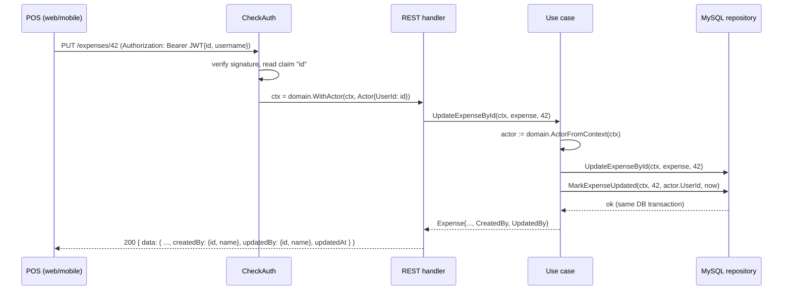
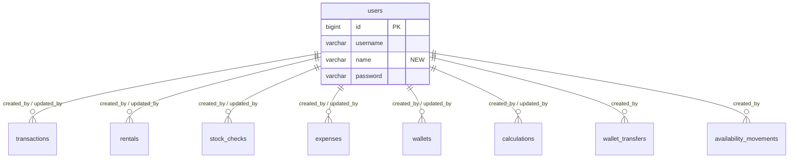
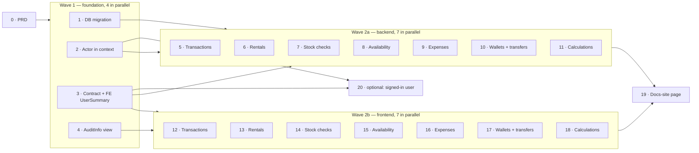

# PRD: User Attribution — Who Created and Last Updated a Record

## Problem Statement

Every POS login is a row in `users` (`apps/api/data/mysql/migrations/000001_initial_schema.up.sql`),
and every authenticated route passes through `CheckAuth`
(`apps/api/presentation/restapi/base_middlewares.go`). But the identity stops there:

1. **The API throws the user away.** `AuthUsecase.Login` (`apps/api/domain/auth_usecase.go`) signs
   a JWT carrying `id` and `username`. `CheckAuth` calls `jwt.Parse` only to validate the signature
   and discards the claims (`_, err = jwt.Parse(...)`). No handler, use case, or repository ever
   learns *who* is calling.
2. **No operational table records an actor.** `transactions`, `rentals`, `stock_checks`,
   `availability_movements`, `expenses`, `wallets`, `wallet_transfers`, and `calculations` carry
   `created_at` (and `calculations` an `updated_at`), but no user column. When a transaction is
   voided and re-paid, an expense is edited, or a stock count looks wrong, there is no way to ask
   the person who did it.
3. **Users have no display name.** `users` has only `username` and `password`. A username is a
   login handle (`kasir1`, `admin`), not something to print next to a transaction.

### Root cause

Authentication was built as a gate (valid token → proceed), not as an identity. The claim that
would answer "who did this" is already in every request's token; it is simply never read, carried,
or stored.

---

## How the Industry Handles This

- **ERP frameworks stamp every row.** Odoo adds `create_uid` / `write_uid` (plus `create_date` /
  `write_date`) to every model automatically; Frappe/ERPNext does the same with `owner` /
  `modified_by`. Both resolve the user's display name at read time, not by copying it into the row.
- **POS products attribute sales to a staff member.** Square, Moka and similar POS systems show the
  "served by"/cashier on the transaction and receipt, which only works because every staff member
  signs in with their own account.
- **Full change history is a separate, heavier feature.** Where products offer "who changed what
  field when", it is an append-only audit log (Odoo's mail tracking, Frappe's Version doctype),
  layered *on top of* the per-row stamps, not instead of them.

---

## Alternatives Considered

### Option A — Per-row `created_by_user_id` / `updated_by_user_id` columns ✅ **Recommended**

- ✅ Answers exactly the asked question ("who created it, who last touched it") with one indexed
  lookup, no extra table to join through time.
- ✅ Matches how every comparable system (Odoo, Frappe) models it; reviewers will recognise it.
- ✅ Additive and nullable — historical rows stay valid, old clients keep working.
- ✅ A later audit log (Option B) can be added on top without undoing anything.
- ❌ Keeps only the *last* updater; intermediate edits are not recorded. Acceptable for the stated
  goal.

### Option B — Generic `audit_logs` table (`entity_type`, `entity_id`, `user_id`, `action`, `diff`) ❌

- ✅ Full history, including deletes.
- ❌ Every list screen needs a "latest row per entity" subquery to show the creator/updater.
- ❌ Needs a diff format, retention policy, and a history UI — far beyond the ask.
- ❌ Polymorphic `entity_id` cannot have a foreign key; referential integrity is lost.

### Option C — Store the username/name string in each row ❌

- ✅ No join on read.
- ❌ Renaming a user leaves stale names everywhere; the point of adding `users.name` is that it is
  the *current* display name.
- ❌ No FK, so typos and deleted accounts are undetectable.

---

## Proposed Solution

### FR-1: Users get a display name

`users.name` (`VARCHAR(255) NOT NULL DEFAULT ''`), backfilled to `username` so every existing
account renders something sensible on day one. `name` is the only user field ever shown in the UI.

### FR-2: Record the creator

Every create path for the scoped records stores the authenticated user as both creator and
updater (a new record has been "last updated" by its creator).

### FR-3: Record the last updater

Every user-initiated mutation of a scoped record through *that record's own endpoints* — including
state transitions such as pay/unpay/complete — overwrites `updated_by_user_id` and `updated_at`.
The full endpoint matrix is in [Attribution matrix](#attribution-matrix).

### FR-4: Expose attribution in the API

Scoped response schemas gain optional `createdBy` / `updatedBy` objects (`{ id, name }`) and
`updatedAt`. Request schemas do **not** change — the actor always comes from the token (D2).

### FR-5: Show attribution in the POS UI

List items show a short "by *Name*" caption; update/detail screens show a
"Created by *Name* · *time* — Last updated by *Name* · *time*" block. Records with no recorded actor
(historical rows, guest orders) degrade gracefully (D12).

### FR-6 *(optional)*: Show who is signed in

`GET /auth/me` returns the current user, so the POS sidebar can show the signed-in name. Useful
when staff share a device, but not required for FR-1..FR-5 — see Phase 20.

---

## System Design Overview

### Request flow



Guest (order app, `RequireSessionId`) and system (`VerifyDokuSignature`, the payment-expiry job)
paths never pass `CheckAuth`, so the context has no actor and nothing is stamped (D5).

### Table structure

One migration (next sequence number, currently `000043_add_user_attribution`) — see D10 for why it
is one migration and not seven.

| Table | New columns | Stamped on |
|---|---|---|
| `users` | `name VARCHAR(255) NOT NULL DEFAULT ''` (backfill `= username`) | — |
| `transactions` | `created_by_user_id`, `updated_by_user_id`, `updated_at` | create, update, pay, unpay, complete, uncomplete |
| `rentals` | `created_by_user_id`, `updated_by_user_id`, `updated_at` | check-in (create), check-out (update) |
| `stock_checks` | `created_by_user_id`, `updated_by_user_id`, `updated_at` | create, update |
| `availability_movements` | `created_by_user_id` | every movement row (append-only log) |
| `expenses` | `created_by_user_id`, `updated_by_user_id`, `updated_at` | create, update |
| `wallets` | `created_by_user_id`, `updated_by_user_id`, `updated_at` | create, update (settings only — D5) |
| `wallet_transfers` | `created_by_user_id` | create (append-only, no update endpoint) |
| `calculations` | `created_by_user_id`, `updated_by_user_id` *(already has `updated_at`)* | create, update, complete |

Column types: `created_by_user_id BIGINT NULL`, `updated_by_user_id BIGINT NULL`,
`updated_at DATETIME NULL`, each `*_user_id` with `FOREIGN KEY ... REFERENCES users(id)` (which
also gives it an index). Sketch of the `up`:

```sql
ALTER TABLE `users` ADD COLUMN `name` VARCHAR(255) NOT NULL DEFAULT '' AFTER `username`;
UPDATE `users` SET `name` = `username` WHERE `name` = '';

ALTER TABLE `transactions`
  ADD COLUMN `created_by_user_id` BIGINT   NULL,
  ADD COLUMN `updated_by_user_id` BIGINT   NULL,
  ADD COLUMN `updated_at`         DATETIME NULL,
  ADD CONSTRAINT `fk_transactions_created_by_user` FOREIGN KEY (`created_by_user_id`) REFERENCES `users` (`id`),
  ADD CONSTRAINT `fk_transactions_updated_by_user` FOREIGN KEY (`updated_by_user_id`) REFERENCES `users` (`id`);
-- same shape for rentals, stock_checks, expenses, wallets;
-- created_by_user_id only for availability_movements and wallet_transfers;
-- *_user_id pair only for calculations.
```

The `down` drops the constraints, then the columns, then `users.name`.



### Backend (Go) changes

| Layer | Change |
|---|---|
| `domain/actor.go` *(new)* | `type Actor struct{ UserId int64 }`, `WithActor(ctx, Actor) context.Context`, `ActorFromContext(ctx) (Actor, bool)`. Unexported context key type, the way `utils/logger/logger.go` does it. |
| `domain/base_entity.go` | `type UserSummary struct{ Id int64; Name string }` and `type Audit struct{ CreatedBy *UserSummary; UpdatedBy *UserSummary; UpdatedAt *time.Time }`, embedded in each scoped entity. |
| `domain/auth_entity.go` | `User.Name string`. |
| `presentation/restapi/base_middlewares.go` | `CheckAuth` keeps the parsed token, reads the `id` claim, and serves `next` with `r.WithContext(domain.WithActor(...))`. A valid token without a numeric `id` is rejected with 401. |
| `domain/<feature>_usecase.go` | Create paths set `Audit` from the actor; mutation paths call `repository.Mark<Feature>Updated(ctx, id, userId, now)` inside the existing `BeginTransaction`. No actor in context → no stamp. |
| `domain/<feature>_repository.go` | One new method per stamped table: `Mark<Feature>Updated(ctx, id int64, userId int64, at time.Time) *Error`; mocks regenerated with `go generate ./...`. |
| `data/mysql/<feature>_entity.go` / `_transformer.go` | The new columns; reads resolve `CreatedBy`/`UpdatedBy` via a shared `data/mysql` helper that batch-loads `SELECT id, name FROM users WHERE id IN (...)` for a page of rows (no N+1). Soft-deleted users still resolve — the mysql `User.DeletedAt` is a plain `*time.Time`, so GORM applies no soft-delete filter. |
| `presentation/restapi/<feature>_transformer.go` | A shared `ToApiUserSummary` maps `*domain.UserSummary` → `*apiContract.UserSummary`; each `ToApi<Feature>` sets `CreatedBy`/`UpdatedBy`/`UpdatedAt`. |

### API contract (`libs/api-contract/src/api.yaml`)

New schema:

```yaml
UserSummary:
  type: object
  required: [id, name]
  properties:
    id:   { type: integer, format: int64 }
    name: { type: string }
```

Added to `Transaction`, `Rental`, `StockCheck`, `Expense`, `Wallet`, `Calculation` —
all **optional** so no existing client breaks:

```yaml
createdBy: { $ref: '#/components/schemas/UserSummary' }
updatedBy: { $ref: '#/components/schemas/UserSummary' }
updatedAt: { type: string, format: date-time }
```

Added to `WalletTransfer` and `AvailabilityMovement`: `createdBy` only.

No request schema changes. No new endpoint, except the optional FR-6:

```yaml
/auth/me:
  get:
    operationId: authMe        # CheckAuth-protected
    responses:
      '200': AuthMeResponse { data: CurrentUser { id, username, name } }
```

### Frontend (`libs/ui`) changes

| Area | Change |
|---|---|
| `domain/entities/User.ts` *(new)* | `UserSummary = { id: number; name: string }` and `Audit = { createdBy: UserSummary \| null; updatedBy: UserSummary \| null; updatedAt: string \| null }`. |
| `domain/entities/{Transaction,Rental,StockCheck,Expense,Wallet,Calculation}.ts` | `& Audit`. `WalletTransfer.ts`, `Availability.ts` (movement): `createdBy: UserSummary \| null`. |
| `data/api/*.transformer.ts` | Map the new optional fields to `null` when absent. |
| `data/mock/*.ts` | Fixtures carry a sample `createdBy`/`updatedBy`. |
| `presentation/views/components/base/AuditInfo.tsx` *(new)* | Pure view: `{ createdBy, createdAt, updatedBy, updatedAt, fallbackCreatorLabel? }` → one or two caption lines; renders nothing when both users are `null`. |
| List items | `TransactionListItem`, `RentalListItem`, `StockCheckListItem`, `ExpenseListItem`, `WalletTransferListItem`, `CalculationListItem`: a "by *Name*" caption. |
| Detail / update screens | `TransactionDetail`, `TransactionUpdateScreen`, `StockCheckUpdateScreen`, `ExpenseUpdateScreen`, `WalletUpdateScreen`, `CalculationUpdateScreen`: an `AuditInfo` block. |
| Availability | `AvailabilityMovementHistorySheet`: "by *Name*" per movement row. |
| Handlers | No new use cases — the existing list/detail use cases already return the entity; handlers pass the new fields through as props. |

No new ESLint boundary is touched: `AuditInfo` is a `components/base` view, entities stay in
`domain/entities`, and no screen imports anything new.

### Attribution matrix

| Endpoint | Record | `created_by` | `updated_by` |
|---|---|---|---|
| `POST /transactions` | transaction | actor | actor |
| `PUT /transactions/{id}` | transaction | — | actor |
| `PUT /transactions/{id}/pay`, `/unpay`, `/complete`, `/uncomplete` | transaction | — | actor |
| `POST /carts/current/checkout` (order app, guest) | transaction | `NULL` | `NULL` |
| `POST /payments/doku/notification`, payment expiry job | transaction | — | unchanged |
| `POST /rentals/checkin` | each rental | actor | actor |
| `POST /rentals/checkout` | each rental / new transaction | — / actor | actor / actor |
| `POST /stock-checks` / `PUT /stock-checks/{id}` | stock check | actor / — | actor / actor |
| `PUT /availability` | each movement row | actor | n/a |
| `POST /transactions` (sale reserves stock) | `sale` movement rows | actor | n/a |
| Order-app checkout (sale reserves stock) | `sale` movement rows | `NULL` | n/a |
| `POST /expenses` / `PUT /expenses/{id}` | expense | actor / — | actor / actor |
| `POST /wallets` / `PUT /wallets/{id}` | wallet | actor / — | actor / actor |
| Pay, expense, transfer changing a wallet's balance | wallet | — | unchanged (D5) |
| `POST /wallets/{id}/transfers` | wallet transfer | actor | n/a |
| `POST /calculations` / `PUT /calculations/{id}` / `PUT .../complete` | calculation | actor / — / — | actor / actor / actor |
| Any `DELETE` | — | unchanged | unchanged (D11) |

---

## Design decisions

- **D1 — Per-row columns, not an audit log.** Option A above. A history log can be layered on later
  without migrating these columns away.
- **D2 — The actor comes only from the verified token.** Never from a request body or header the
  client controls; request schemas do not change. A client cannot claim to be someone else.
- **D3 — The actor travels in `context.Context`, set once by `CheckAuth`.** Every use case already
  takes `ctx`, and `ctx` already crosses into the sale-movement path in
  `domain/availability_reservation.go` and into the nested `BeginTransaction` closures.
  *Alternative rejected:* an explicit `userId` parameter on every mutating use case method — about
  25 signatures, every handler call site, and every test change, and the reservation path would
  need it threaded through `TransactionUsecase` too. *Alternative rejected:* a global GORM
  callback that stamps any table with the column — invisible at the call site, cannot tell a guest
  or webhook write from a user write, and many writes here use `Table(...).Updates(map)` where the
  intent is hard to see.
- **D4 — The use case stamps; the repository persists.** Create paths set the embedded `Audit` on
  the entity. Mutation paths call a dedicated `Mark<Feature>Updated(ctx, id, userId, at)` inside
  the same DB transaction, so narrow repository methods (`PayTransaction`, `UnpayTransaction`,
  `UpdateStockCheckById`, …) keep their signatures. One extra single-row `UPDATE` per mutation is
  negligible at this scale.
- **D5 — "Last updated" means the last user-initiated change through the record's own
  endpoints.** Side effects on *other* records do not stamp them: paying a transaction changes a
  wallet's balance but does not make the cashier the wallet's last updater — the transaction
  already records who paid. Guest (order app) and system (DOKU webhook, expiry job) writes never
  stamp and never overwrite an existing stamp; with no actor in context, `Mark…Updated` is simply
  not called.
- **D6 — Nullable, no backfill guess.** Historical rows keep `NULL`; there is no honest way to
  infer who created them. The UI hides the line rather than showing "Unknown".
- **D7 — `users.name` is resolved at read time, not copied or put in the JWT.** Renaming a user
  updates every screen immediately, and existing tokens (which carry only `id`, `username`) keep
  working — no forced re-login.
- **D8 — The API exposes `UserSummary { id, name }`, never the user row.** No `username`, no
  password hash leaves the API via these fields.
- **D9 — `updated_at` is added where missing and set by the application, not
  `ON UPDATE CURRENT_TIMESTAMP`.** It must move together with `updated_by_user_id`; a DB-level
  `ON UPDATE` would also fire on the side-effect writes that D5 excludes (e.g. a wallet's balance),
  making the pair disagree. `calculations.updated_at` already exists with `ON UPDATE`; it is kept,
  since calculations are only ever written through their own user endpoints.
- **D10 — One migration and one contract change up front; feature phases touch neither.**
  golang-migrate numbers are sequential, so seven parallel PRs each adding a migration would all
  claim `000043` and collide. Nullable, unused columns and optional, unpopulated response fields are
  harmless, so landing them first lets every feature phase run in parallel.
- **D11 — Deletes record nothing.** Deleted rows are hidden everywhere, so a `deleted_by` would
  have no screen to appear on. Deferred, not rejected.
- **D12 — Guest-created transactions are labelled from `source`, not a fake user.** A
  `source = 'order'` transaction with `createdBy = null` renders "Customer (order app)".
  *Alternative rejected:* seeding a pseudo-user row for guests — it would be a loginable account
  (or a special case in `AuthUsecase`) that exists only for display.
- **D13 — Availability attribution lives on `availability_movements`.** Availability is already
  modelled as a movement log; the latest movement answers "who last changed this", so
  `products`/`variants` get no new columns.

---

# Implementation Plan — Phased PRs

Each phase is one small PR that leaves `main` green and the product shippable. Frontend phases
may merge before their backend phase: the fields are optional, so the UI renders nothing until
the API fills them.



**Parallelism summary**

- **Wave 1** — Phases 1, 2, 3, 4 are fully independent (SQL, Go middleware, YAML + TS types, a
  pure view).
- **Wave 2a** — backend Phases 5–11 each need 1 + 2 + 3 and nothing from each other; up to seven
  in flight at once. The only shared file is `domain/rental_usecase.go`, touched by Phase 5 (the
  transaction it creates on checkout) and Phase 6 (the rentals it updates) in different functions —
  a trivial merge.
- **Wave 2b** — frontend Phases 12–18 each need 3 + 4 and can run alongside Wave 2a; they are
  developed and tested against mock repositories, so they never wait on the backend.
- **Pairs** — a single developer can take a domain end-to-end (e.g. 5 + 12) as two PRs, or combine
  them into one if smaller PR count is preferred over smaller PR size.
- **Wave 3** — Phase 19 after everything; Phase 20 is optional and can start any time after 2 + 3.

| # | PR | Main files | Depends on | Size | Acceptance |
|---|---|---|---|---|---|
| **0** | This PRD | `docs/prd-user-attribution.md` | — | ~450 L | Reviewer agrees with the attribution matrix and D1–D13 |
| **1** | DB migration | `apps/api/data/mysql/migrations/000043_add_user_attribution.{up,down}.sql` | 0 | ~90 L SQL | `up` → `down` → `up` round-trips on a copy of prod data; every existing user has `name = username` |
| **2** | Actor in context | `domain/actor.go` (+test), `presentation/restapi/base_middlewares.go` (+test) | 0 | ~150 L | A valid token yields `ActorFromContext(ctx) == {UserId: id}`; a token without `id` → 401; public, session and DOKU routes carry no actor |
| **3** | Contract + FE types | `libs/api-contract/src/api.yaml`, `libs/ui/src/domain/entities/User.ts`, `entities/index.ts`, `data/api` `toUserSummary` helper | 0 | ~120 L | Codegen (`generate:go`, `generate:ts`) succeeds; `npx nx run api:test` and `ui:test` green with no behaviour change |
| **4** | `AuditInfo` view | `presentation/views/components/base/AuditInfo.tsx` + `.stories.tsx` + `.test.tsx`, `base/index.tsx` | 0 | ~150 L | Stories for: both users, creator only, `null`s (renders nothing), guest fallback label |
| **5** | BE: transactions | `domain/transaction_{entity,usecase,repository}.go`, `domain/rental_usecase.go` (checkout's transaction), `data/mysql/transaction_*`, `data/mock`, `presentation/restapi/transaction_transformer.go`, tests | 1, 2, 3 | ~300 L | Matrix rows for transactions hold in use case tests; order checkout and DOKU settle leave stamps untouched |
| **6** | BE: rentals | `domain/rental_*`, `data/mysql/rental_*`, `restapi/rental_transformer.go`, tests | 1, 2, 3 | ~200 L | Check-in stamps create+update on every rental; checkout stamps update |
| **7** | BE: stock checks | `domain/stock_check_*`, `data/mysql/stock_check_*`, `restapi/stock_check_transformer.go`, tests | 1, 2, 3 | ~180 L | Create/update stamped; list response carries `createdBy` |
| **8** | BE: availability | `domain/availability_{usecase,reservation,movement_entity}.go`, `data/mysql/availability_*`, `restapi/availability_transformer.go`, tests | 1, 2, 3 | ~180 L | Manual movements and POS `sale` movements carry the actor; order-app `sale` movements are `NULL` |
| **9** | BE: expenses | `domain/expense_*`, `data/mysql/expense_*`, `restapi/expense_transformer.go`, tests | 1, 2, 3 | ~180 L | Create/update stamped; statistics endpoints unchanged |
| **10** | BE: wallets + transfers | `domain/wallet_*`, `data/mysql/wallet_*`, `restapi/wallet_transformer.go`, tests | 1, 2, 3 | ~220 L | Wallet create/update and transfer create stamped; paying a transaction does **not** change the wallet's `updatedBy` |
| **11** | BE: calculations | `domain/calculation_*`, `data/mysql/calculation_*`, `restapi/calculation_transformer.go`, tests | 1, 2, 3 | ~180 L | Create/update/complete stamped |
| **12** | FE: transactions | `entities/Transaction.ts`, `data/api/transaction.transformer.ts`, `data/mock/transaction.ts`, `TransactionListItem`, `TransactionDetail`, `TransactionUpdateScreen`, stories + tests | 3, 4 | ~250 L | Caption and `AuditInfo` render; `source = 'order'` with no creator shows "Customer (order app)" |
| **13** | FE: rentals | `entities/Rental.ts`, `rental.transformer.ts`, `data/mock/rental.ts`, `RentalListItem`, stories + tests | 3, 4 | ~150 L | "Checked in by" on every row; "Checked out by" once `checkoutAt` is set |
| **14** | FE: stock checks | `entities/StockCheck.ts`, `stockCheck.transformer.ts`, mock, `StockCheckListItem`, `StockCheckUpdateScreen`, stories + tests | 3, 4 | ~150 L | Caption + `AuditInfo` render |
| **15** | FE: availability | `entities/Availability.ts`, `availability.transformer.ts`, mock, `AvailabilityMovementHistorySheet`, story + test | 3, 4 | ~100 L | Each movement row shows "by *Name*"; `sale` rows without a user show nothing extra |
| **16** | FE: expenses | `entities/Expense.ts`, `expense.transformer.ts`, mock, `ExpenseListItem`, `ExpenseUpdateScreen`, stories + tests | 3, 4 | ~150 L | Caption + `AuditInfo` render |
| **17** | FE: wallets + transfers | `entities/{Wallet,WalletTransfer}.ts`, `wallet.transformer.ts`, mock, `WalletUpdateScreen`, `WalletTransferListItem`, stories + tests | 3, 4 | ~150 L | `AuditInfo` on wallet update; "by *Name*" on each transfer |
| **18** | FE: calculations | `entities/Calculation.ts`, `calculation.transformer.ts`, mock, `CalculationListItem`, `CalculationUpdateScreen`, stories + tests | 3, 4 | ~150 L | Caption + `AuditInfo` render |
| **19** | Docs-site page | `docs-site/operations/` page + sidebar entry | 5–18 | ~80 L | Explains the per-staff-account requirement and where attribution appears |
| **20** | *(optional)* Signed-in user | `api.yaml` (`authMe`), `domain/auth_*`, `restapi/auth_*`, `libs/ui` `authMe` use case + `useAuthLogout` → session hook, `Layout`/`Sidebar` | 2, 3 | ~300 L | Sidebar shows the signed-in `name` on every POS screen |

### Phase notes

- **Phase 1** — create with `make migrate-create name=add_user_attribution`; run with
  `MIGRATIONS_DIR=data/mysql/migrations` (the `Makefile` default is wrong, see
  `apps/api/CLAUDE.md`). Only schema; no Go reads the columns yet.
- **Phase 2** — pure plumbing: nothing reads the actor yet, so it is behaviour-neutral except for
  rejecting a token with no `id`, which `AuthUsecase.Login` has never issued.
- **Phase 3** — the `libs/ui` Jest config stubs `api-contract` entirely
  (`src/__mocks__/api-contract.ts`); the new schema is types-only, so the stub needs no change.
  Entity fields are *not* added here — each FE phase adds its own, so this PR does not have to
  update every fixture in the repo at once.
- **Phases 5–11** — each follows the `budget` reference slice in `apps/api/CLAUDE.md`: entity →
  repository interface + `go generate ./...` → use case + test → mysql entity/transformer →
  restapi transformer → handler test asserting the new response fields. Each includes a use case
  test with no actor in context proving nothing is stamped.
- **Phases 12–18** — no new use case: the existing list/update use cases already return the entity.
  Handler tests use real use cases over mock repositories and assert on the rendered name
  (`CLAUDE.md`, "Tests"). Run the matching `pos-web-e2e` spec locally if a list item's text
  changes — e2e only runs post-merge.
- **Phase 20** — 56 POS handlers already pass `onLogoutPress` to `Layout` via the shared
  `useAuthLogout` hook; widening that hook to also return the current user is the one-place change,
  but it still touches every handler's `Layout` props, which is why it is split out and optional.

---

## Risks

- **Shared logins make attribution meaningless.** If the shop floor uses one `kasir` account, every
  record says "kasir". The feature only pays off once each staff member has their own account —
  see Rollout Notes.
- **Token lifetime.** `AuthUsecase.Login` signs no `exp`, and `CheckAuth` does not check that the
  user still exists, so a soft-deleted user's old token still works and is still attributed.
  Pre-existing; noted here because this feature makes it visible, not fixed by it.
- **Migration lock time.** `ADD COLUMN ... NULL` is instant on MySQL 8, but each `ADD CONSTRAINT
  FOREIGN KEY` builds an index. Run Phase 1 outside opening hours; `transactions` is the largest
  table.
- **Missed mutation paths.** A new endpoint added later may forget to call `Mark…Updated`. Each
  backend phase's tests cover every row of the matrix, and `apps/api/CLAUDE.md` gains one checklist
  line in Phase 5 so review catches it for future endpoints.
- **E2E text matchers.** A new caption in a list item can break a Playwright locator that matches
  the item's full text; e2e runs only post-merge, so run the affected spec locally in each FE phase.

## Out of Scope

- Full change history / field-level diffs (Option B).
- `deleted_by` (D11).
- Filtering or grouping lists and statistics by user (e.g. "sales per cashier").
- A user-management UI (create accounts, set names, reset passwords). Accounts and names are
  maintained in SQL, as accounts are today.
- Attribution on records outside the requested set (products, materials, budgets, checklists, …).
  The `Audit` embed and `Mark…Updated` pattern make each one a copy of Phases 5 + 12 later.

## Open Questions

1. **Cashier on the receipt?** `TransactionPrintEmployee` / `TransactionPrintCustomer` could print
   the creator's name. Cheap once Phase 12 lands; product call.
2. **Editable name in-app?** A `PUT /auth/me` to change one's own `name`, or keep SQL-only until a
   user-management feature exists?
3. **KDS account.** The KDS app signs in (`libs/ui/src/app/kds/AuthLogin.tsx`); should its actions
   be attributed to a dedicated "Kitchen" account? Recommended, and it needs no code.
4. **Per-cashier sales report.** The natural next feature once data accumulates — confirm it is a
   separate PRD.

## Rollout Notes

1. Before Phase 1 ships, create one account per staff member (SQL), and after it ships set each
   account's `name`.
2. Phase 1 must be applied (`make migrate-up`) before any of Phases 5–11 is deployed, since those
   read the new columns.
3. Frontend phases can deploy in any order relative to backend phases.
4. Records created before rollout show no attribution; that is expected (D6).

## Success Criteria (post-rollout)

- Every transaction, rental, stock check, expense, wallet change, transfer, calculation, and manual
  availability change made from the POS after rollout shows a named creator/updater.
- Order-app transactions show "Customer (order app)", never a staff name.
- No change in response time for list endpoints beyond one batched user lookup per page.

## Sources

- Odoo ORM reference, automatic fields `create_uid` / `write_uid`:
  https://www.odoo.com/documentation/17.0/developer/reference/backend/orm.html
- Frappe framework, standard DocType fields `owner` / `modified_by`:
  https://frappeframework.com/docs/user/en/basics/doctypes
